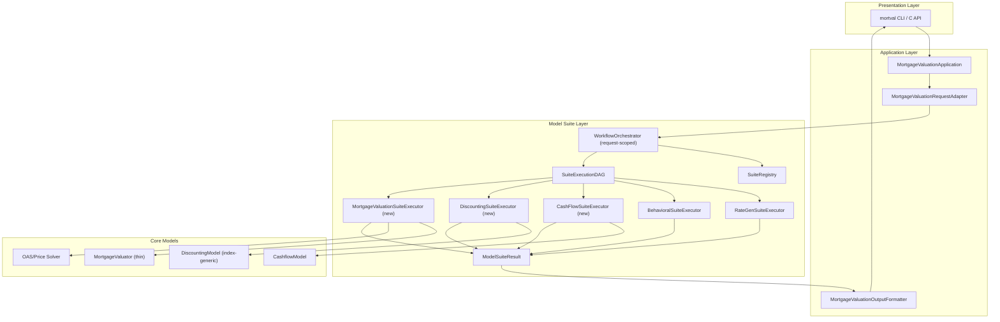
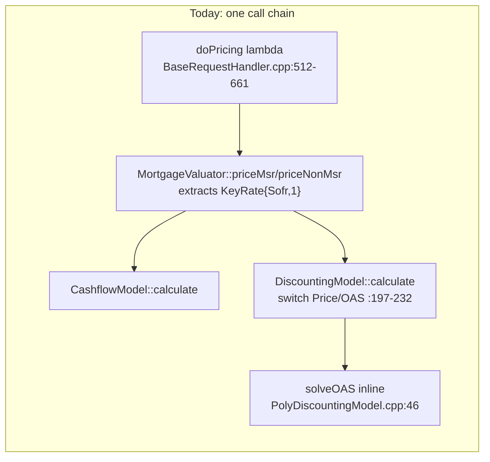
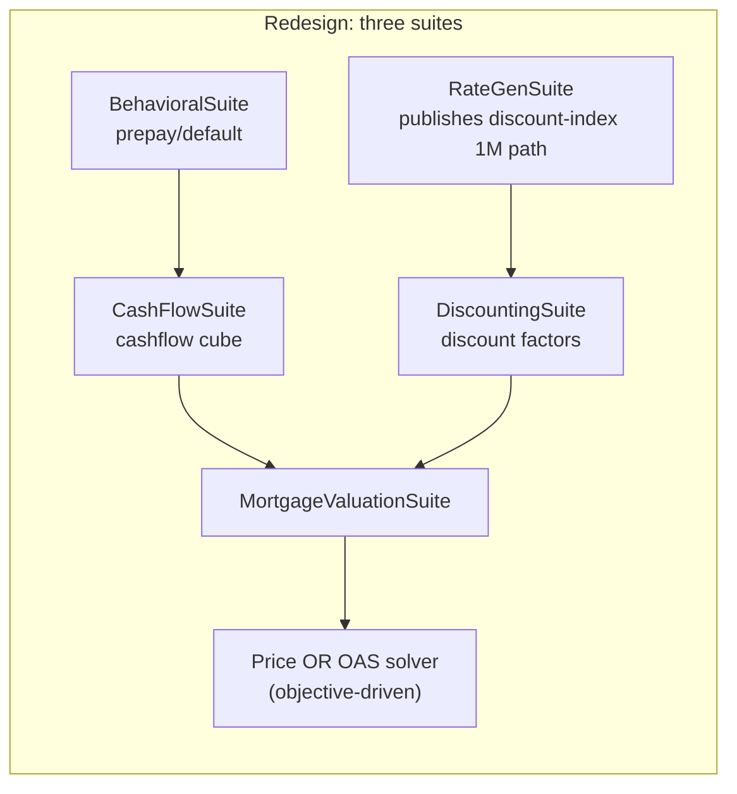
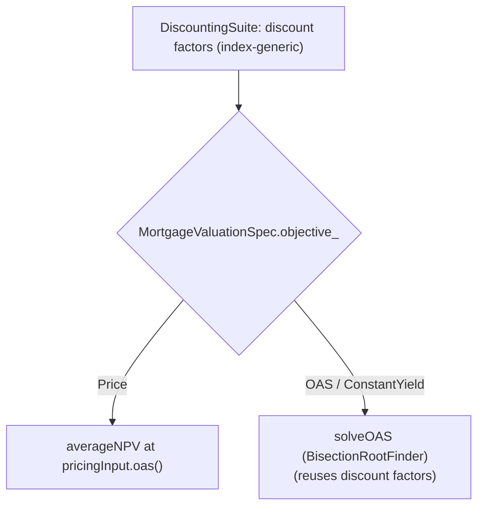
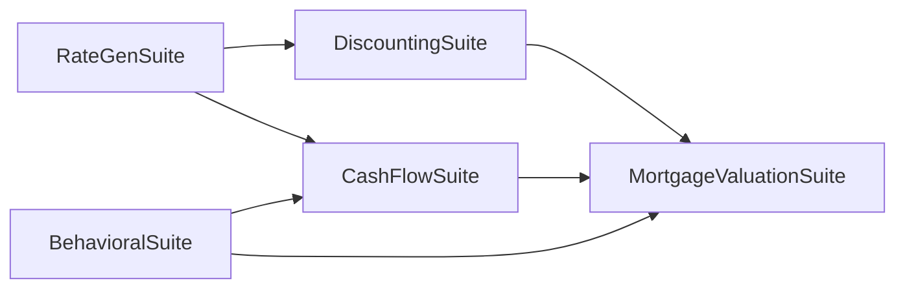
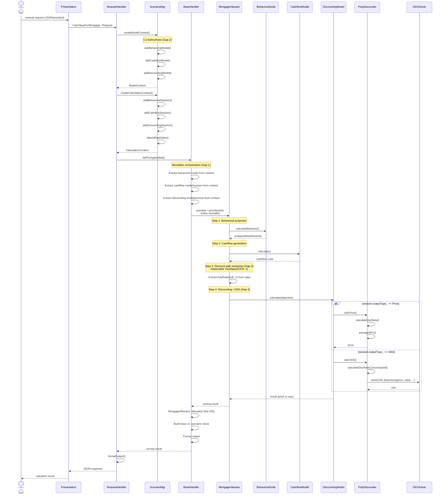
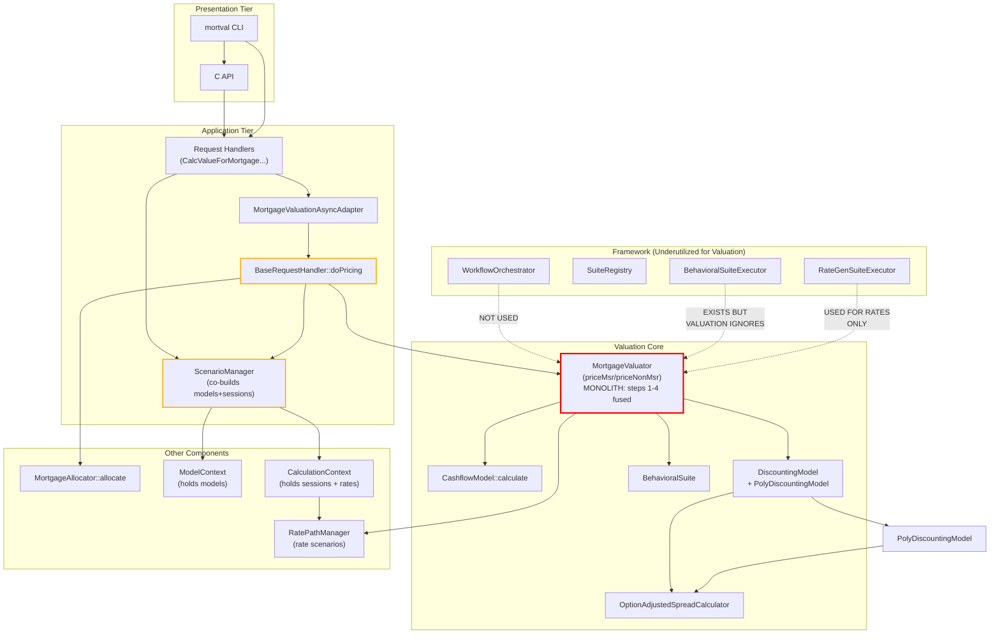

# Mortgage Valuation Redesign for the Model Suite Framework

**Target framework:** New layered architecture with Presentation, Application, Model Suite, Data Access, common services, suite registry, DAG orchestration, and suite result contracts (see `proposed_design.md`).
**Status:** Base design + enhancements for modularization, index-generic discounting, and pricing/OAS separation
**Companion designs:** `proposed_design.md` (baseline framework), `BehavioralModelWorkflow.md` (behavioral suite reference), `RateGenerationModelSuiteRedesign.md` (rate suite reference)

---

## Table of Contents

- [1. Summary](#1-summary)
- [2. Design Goals](#2-design-goals)
- [3. Proposed Layering](#3-proposed-layering)
- [4. New Suites: CashFlow, Discounting, MortgageValuation](#4-new-suites-cashflow-discounting-mortgagevaluation)
- [5. Proposed Request Model](#5-proposed-request-model)
- [6. Suite Decomposition and Boundaries](#6-suite-decomposition-and-boundaries)
- [7. Index-Generic Discounting (De-SOFR-ing)](#7-index-generic-discounting-de-sofr-ing)
- [8. Pricing / OAS Separation](#8-pricing--oas-separation)
- [9. Workflow Orchestrator Changes](#9-workflow-orchestrator-changes)
- [10. Result and Intermediate Contracts](#10-result-and-intermediate-contracts)
- [11. Suite Dependency Model](#11-suite-dependency-model)
- [12. Migration Strategy](#12-migration-strategy)
- [13. Testing Plan](#13-testing-plan)
- [14. Risks and Mitigations](#14-risks-and-mitigations)
- [15. Recommended First Implementation Slice](#15-recommended-first-implementation-slice)
- [16. Key Design Decisions](#16-key-design-decisions)
- [17. Summary of New Components](#17-summary-of-new-components)
- [18. Concrete Registry Update (Drop-in Proposal)](#18-concrete-registry-update-drop-in-proposal)
- [Appendix A: Current Workflow Components and Interactions](#appendix-a-current-workflow-components-and-interactions)

---

## 1. Summary

### 1.1 Core Principle

Mortgage valuation should be migrated into the new model-suite framework as a set of composable suites rather than a single monolithic pricing path. The current implementation collapses **behavioral projection**, **cashflow generation**, **discounting**, and **price/OAS solving** into one call chain (`BaseRequestHandler::doPricing` → `MortgageValuatorAsyncAdapter::price` → `MortgageValuator::priceMsr/priceNonMsr` → `DiscountingModel::calculate`), with model construction and session preparation entangled in `ScenarioManager`.

This redesign splits that chain into three cooperating suites — **`CashFlowSuite`**, **`DiscountingSuite`**, and **`MortgageValuationSuite`** — that consume the shared rate paths published by `RateGenSuite` (see `RateGenerationModelSuiteRedesign.md`) and the behavioral results published by `BehavioralSuite` (see `BehavioralModelWorkflow.md`).

### 1.2 What Each Suite Owns

- **`CashFlowSuite`** — builds the cashflow model + session, projects cashflow cubes per collateral/path/step, and publishes them as a reusable intermediate.
- **`DiscountingSuite`** — derives discount factors from the **discount-index** short rate (not hardcoded SOFR 1M), and produces present values.
- **`MortgageValuationSuite`** — orchestrates portfolio allocation, base vs. scenario pricing, price-vs-OAS intent, and result assembly. It consumes cashflows and discount factors rather than building them inline.

### 1.3 Key Enhancements

Analysis of the current valuation path reveals five gaps this redesign addresses.

#### Gap 1: Monolithic Pricing Orchestration (No Suite Separation)

`BaseRequestHandler::doPricing` is a ~150-line method ([cc/src/app-common/messages/handlers/BaseRequestHandler.cpp:512](cc/src/app-common/messages/handlers/BaseRequestHandler.cpp)–661) whose inner lambda pulls behavioral models, cashflow model+session, discounting model+session, and the rate-path manager all out of one scenario context and drives them in a fixed sequence:

- behavioral models extracted from context inside the lambda ([BaseRequestHandler.cpp:544](cc/src/app-common/messages/handlers/BaseRequestHandler.cpp)–554),
- cashflow model+session looked up from a context map ([BaseRequestHandler.cpp:567](cc/src/app-common/messages/handlers/BaseRequestHandler.cpp)–571),
- a single `basePricingAdapter.price(...)` call passes behavioral, cashflow, discounting, context, and rates together ([BaseRequestHandler.cpp:575](cc/src/app-common/messages/handlers/BaseRequestHandler.cpp)–585).

There is no seam at which cashflow generation, discounting, or OAS solving can be substituted, cached, or run as an independent suite.

#### Gap 2: Cashflow and Discounting Are Prepared as One Blob

Model construction and session preparation for cashflow and discounting are added to the **same** context builder and built in one shot inside `ScenarioManager`:

- `addDiscountingModel()` and `addCashflowModel()` are called back-to-back on the same `modelCtxBuilder` before a single `build()` ([cc/src/app-common/messages/ScenarioManager.cpp:631](cc/src/app-common/messages/ScenarioManager.cpp), [ScenarioManager.cpp:635](cc/src/app-common/messages/ScenarioManager.cpp)),
- `addDiscountingSession()` and `addCashflowSession()` likewise share one `calcCtxBuilder` ([ScenarioManager.cpp:656](cc/src/app-common/messages/ScenarioManager.cpp)–657),
- the top-level `createModelContextImpl()` wires both in sequence ([ScenarioManager.cpp:1720](cc/src/app-common/messages/ScenarioManager.cpp)–1750).

Because they are co-built, neither can be versioned, validated, or cached independently, and there is no contract describing what discounting needs from cashflow.

#### Gap 3: Hardcoded SOFR-1M Discounting

Discounting is locked to the SOFR 1M short rate in three places:

1. `MortgageValuator::priceMsr` extracts `rates.get(KeyRate{ProductType::Sofr, 1})` ([cc/src/core/MortgageValuator.cpp:125](cc/src/core/MortgageValuator.cpp)).
2. `MortgageValuator::priceNonMsr` repeats the same extraction ([MortgageValuator.cpp:258](cc/src/core/MortgageValuator.cpp)).
3. The discounting contract itself names the parameter `sofr1mRatePaths` ([cc/wfmcm/DiscountingModel.h:47](cc/wfmcm/DiscountingModel.h), [DiscountingModel.h:58](cc/wfmcm/DiscountingModel.h)), and both `PolyDiscountingModel::calcOAS` / `calcPrice` consume it directly ([cc/src/core/discounter/PolyDiscountingModel.cpp:12](cc/src/core/discounter/PolyDiscountingModel.cpp)–53, [PolyDiscountingModel.cpp:56](cc/src/core/discounter/PolyDiscountingModel.cpp)–100).

This mirrors Gap 4 of the rate-gen redesign (`discountIndex_`): the valuation side must consume a discount-index-neutral path rather than a literal SOFR key.

#### Gap 4: Price and OAS Solving Are Fused in the Discounting Model

`DiscountingModel::calculate` switches on `session.outputType_` and dispatches to **either** `calcPrice` **or** `calcOAS` with identical inputs ([cc/src/core/discounter/DiscountingModel.cpp:197](cc/src/core/discounter/DiscountingModel.cpp)–232). The OAS bisection solve (`oas_calc_details::solveOAS` over `BisectionRootFinder`) is embedded inside the discounting model ([cc/src/core/discounter/PolyDiscountingModel.cpp:46](cc/src/core/discounter/PolyDiscountingModel.cpp), solver at [cc/src/core/OptionAdjustedSpreadCalculator.cpp:106](cc/src/core/OptionAdjustedSpreadCalculator.cpp)–121). Present-value computation, discount-factor derivation, and root-finding are one unit, so a price run and an OAS run cannot share the discount stage or be independently tested.

#### Gap 5: Suite Infrastructure Exists but Valuation Does Not Use It

The suite framework is already present under [cc/src/core/model-suite/](cc/src/core/model-suite/) — `SuiteExecutor` ([SuiteExecutor.h](cc/src/core/model-suite/SuiteExecutor.h)), `WorkflowOrchestrator` ([WorkflowOrchestrator.h](cc/src/core/model-suite/WorkflowOrchestrator.h)), `SuiteRegistry` ([SuiteRegistry.h](cc/src/core/model-suite/SuiteRegistry.h)), `SuiteResult` ([SuiteResult.h](cc/src/core/model-suite/SuiteResult.h)), and a working `BehavioralSuiteExecutor` ([BehavioralSuiteExecutor.h](cc/src/core/model-suite/BehavioralSuiteExecutor.h)) — but there is **no `CashFlowSuiteExecutor`, `DiscountingSuiteExecutor`, or `MortgageValuationSuiteExecutor`**, and the request handlers still call `doPricing` directly. The redesign fills exactly those three gaps by reusing the existing executor/orchestrator contracts.

---

## 2. Design Goals

1. **Preserve existing numerical behavior**
   - Initial migration wraps the existing `MortgageValuator`, `CashflowModel`, and `DiscountingModel` logic behind suite executors.
   - Refactoring is behavior-preserving before any algorithmic change; SOFR discounting output must match golden values bit-for-bit.

2. **Make valuation a set of model suites**
   - Cashflow, discounting, and valuation each have domain models, sessions, output contracts, diagnostics, and downstream dependencies — they qualify as suites, not helpers.

3. **Keep the Application Layer thin**
   - No pricing orchestration, model extraction, or OAS logic in `mortval` application functions; only request adaptation and output formatting.

4. **Publish reusable suite outputs**
   - Cashflow cubes and discount factors should be available through `ModelSuiteResult` / `IntermediateResult` so pricing, greeks, waterfall, and profitability suites can consume them without recomputation.

5. **Separate pricing intent from discounting mechanics**
   - Price vs. OAS is an orchestration decision, not a branch buried inside the discounting model.

6. **Support all current valuation entry points through the suites**
   - `CalcValueForMortgageRequestHandler`, `CalcValueForMortgageWithSofrRatesRequestHandler`, `CalcValueForMortgageFromRatesRequestHandler`, `CalcValueForMonthEndRollRequestHandler`, `CalcGreeksFromPricesRequestHandler`, and `AttribValueChangeByWaterfallRequestHandler` should route through the valuation suite DAG. `CalcProfitabilityFromBehavioralSpeedsRequestHandler` is the exception: it already consumes precomputed behavioral speeds via its own `Profitability` engine and depends on `BehavioralSuite`, not `MortgageValuationSuite`.

---

## 3. Proposed Layering

### 3.1 Reuse Contract with the Overall Model-Suite Workflow

This redesign **reuses** the end-to-end architecture defined in `proposed_design.md`. The valuation suites are additional suites inside that architecture, not a parallel framework.

Reused as-is:

- **Presentation / Application Layers**: existing CLI/C API entry, thin request mapping, output formatting.
- **ModelSuiteLayer facade** ([ModelSuitesLayer.h](cc/src/core/model-suite/ModelSuitesLayer.h)) and **WorkflowOrchestrator** lifecycle.
- **SuiteRegistry** declarative dependency/metadata contract.
- **DataAccessLayer** boundary with cache hierarchy.
- **ModelSuiteResult** + namespaced intermediate results.

Extended for valuation:

- New suite metadata + executors for `CashFlowSuite`, `DiscountingSuite`, `MortgageValuationSuite`.
- New valuation request payload (`MortgageValuationSpec`).
- A `DiscountConsumptionContract` describing the discount-index path the valuation needs.

Non-goals:

- No new orchestration engine, caching subsystem, or extra application layer.
- No change to model numerics beyond the SOFR→discount-index generalization behind characterization tests.

### 3.2 Layered Valuation Architecture



---

## 4. New Suites: CashFlow, Discounting, MortgageValuation

### 4.1 Suite Identities

| Suite | `suiteId` | Depends on | Publishes |
|---|---|---|---|
| CashFlow | `CashFlowSuite` | `RateGenSuite`, `BehavioralSuite` | `intermediate["cashflow"]["cubes"]` |
| Discounting | `DiscountingSuite` | `RateGenSuite` | `intermediate["discounting"]["discount_factors"]` |
| MortgageValuation | `MortgageValuationSuite` | `CashFlowSuite`, `DiscountingSuite`, `BehavioralSuite` | `PricingResult` + `intermediate["valuation"][...]` |

### 4.2 CashFlowSuite Responsibilities

Owns (extracted from today's inline path):

- building the cashflow model + session (moving `addCashflowModel` / `addCashflowSession` out of `ScenarioManager` monolith, [ScenarioManager.cpp:264](cc/src/app-common/messages/ScenarioManager.cpp), [ScenarioManager.cpp:281](cc/src/app-common/messages/ScenarioManager.cpp)),
- projecting the cashflow cube via `CashflowModel::calculate` ([cc/wfmcm/CashflowModel.h:17](cc/wfmcm/CashflowModel.h)–56),
- consuming behavioral results (prepay/default/severity) from `intermediate["behavioral"]`,
- publishing the cube as a reusable intermediate.

Does **not** discount, solve OAS, or format output.

### 4.3 DiscountingSuite Responsibilities

Owns:

- building the discounting model + session (from `addDiscountingModel` / `addDiscountingSession`, [ScenarioManager.cpp:251](cc/src/app-common/messages/ScenarioManager.cpp), [ScenarioManager.cpp:302](cc/src/app-common/messages/ScenarioManager.cpp)),
- consuming the discount-index 1M path published by `RateGenSuite` (`intermediate["rates"]["base/discount"]`, derived by `RateGenSuite`'s `DiscountRateDeriver` from `KeyRate{ forwardRateType(discountIndex), 1 }`) instead of extracting the hardcoded `KeyRate{Sofr,1}` ([MortgageValuator.cpp:125](cc/src/core/MortgageValuator.cpp), [MortgageValuator.cpp:258](cc/src/core/MortgageValuator.cpp)),
- computing discount factors / present values (the `calculateDiscRate` + `averageNPV` mechanics currently inside `PolyDiscountingModel`).

> **Ownership note:** the discount path itself is *derived* by `RateGenSuite` (its `DiscountRateDeriver`, Stage 2 of the lazy pipeline — see `RateGenerationModelSuiteRedesign.md` §4.5), not by `DiscountingSuite`. `DiscountingSuite` *consumes* that path and turns it into discount factors.

Does **not** own price-vs-OAS selection (that becomes an input from the valuation suite).

### 4.4 MortgageValuationSuite Responsibilities

Owns:

- portfolio allocation via `MortgageAllocator::allocate` (today at [BaseRequestHandler.cpp:625](cc/src/app-common/messages/handlers/BaseRequestHandler.cpp)),
- base vs. scenario orchestration and `useBaseOAS` view transformation ([BaseRequestHandler.cpp:587](cc/src/app-common/messages/handlers/BaseRequestHandler.cpp)–618),
- driving price **or** OAS by consuming cashflows + discount factors from the two suites above,
- assembling `PricingResult` and publishing valuation intermediates.

### 4.5 Suite Non-Responsibilities

None of these suites should read files, parse CLI arguments, write files, own process-scoped registry state, mutate portfolio objects, embed CLI output layout, or call another suite directly.

---

## 5. Proposed Request Model

### 5.1 `MortgageValuationSpec`

```cpp
struct MortgageValuationSpec {
    // Pricing intent is an orchestration decision, NOT a branch inside the
    // discounting model (replaces the DiscountingModel.calculate switch on
    // session.outputType_ at DiscountingModel.cpp:197-232).
    enum class Objective { Price, OAS, ConstantYield };
    Objective objective_ = Objective::Price;

    bool isCleanPrice_        = true;
    bool useBaseOAS_          = false;   // matches BaseRequestHandler.cpp:587
    std::optional<std::set<DebugInfoType>> debugTypes_;

    // Index the discount path is derived from. Default SOFR preserves current
    // numerical behavior; Treasury enables Treasury discounting (see Gap 3 and
    // RateGenerationModelSuiteRedesign.md Section 6A).
    InterestRateType discountIndex_ = InterestRateType::Sofr;

    // When set, cashflows / discount factors are taken from upstream suite
    // intermediates instead of being recomputed inline.
    bool consumeSuppliedCashflows_      = false;
    bool consumeSuppliedDiscountFactors_ = false;
};
```

`WorkflowRequest` gains `std::optional<MortgageValuationSpec> mortgageValuationSpec_;`.

### 5.2 `DiscountConsumptionContract`

Mirrors the rate suite's `RateConsumptionContract`. The valuation suite declares the discount-index path it needs; the orchestrator ensures `RateGenSuite` produces `KeyRate{ forwardRateType(discountIndex_), 1 }`.

```cpp
struct DiscountConsumptionContract {
    InterestRateType discountIndex = InterestRateType::Sofr;
    bool requiresDiscountFactors   = true;
    // conflicting discount-index requirements across consumers => plan-time error
};
```

### 5.3 Application Adapter

Create:

- `cc/src/app-layer/MortgageValuationApplication.h/.cpp`
- `cc/src/app-layer/MortgageValuationRequestAdapter.h/.cpp`
- `cc/src/app-layer/MortgageValuationOutputFormatter.h/.cpp`

The adapter maps `RunConfig` into `WorkflowRequest::requestedSuites_ = {"MortgageValuationSuite"}` plus `mortgageValuationSpec_`; it does not read files or run pricing.

---

## 6. Suite Decomposition and Boundaries

### 6.1 Before (today) vs. After





### 6.2 Boundary Contracts

| Producer | Intermediate key | Consumer |
|---|---|---|
| `RateGenSuite` | `intermediate["rates"]["base/discount"]` | `DiscountingSuite` |
| `BehavioralSuite` | `intermediate["behavioral"][...]` | `CashFlowSuite` |
| `CashFlowSuite` | `intermediate["cashflow"]["cubes"]` | `MortgageValuationSuite` |
| `DiscountingSuite` | `intermediate["discounting"]["discount_factors"]` | `MortgageValuationSuite` |

Each contract makes explicit what today is an implicit ordering inside `priceMsr`/`priceNonMsr`, where behavioral projection ([MortgageValuator.cpp:130](cc/src/core/MortgageValuator.cpp)–139), cashflow generation ([MortgageValuator.cpp:141](cc/src/core/MortgageValuator.cpp)–152), and discounting ([MortgageValuator.cpp:154](cc/src/core/MortgageValuator.cpp)–160) run inline in one method.

---

## 7. Index-Generic Discounting (De-SOFR-ing)

### 7.1 The Three Seams to Generalize

| Seam | Today | Redesigned |
|---|---|---|
| Rate extraction | `rates.get(KeyRate{ProductType::Sofr, 1})` ([MortgageValuator.cpp:125](cc/src/core/MortgageValuator.cpp), [:258](cc/src/core/MortgageValuator.cpp)) | `rates.get(KeyRate{ forwardRateType(spec.discountIndex_), 1 })` |
| API parameter | `matrix_view<double> sofr1mRatePaths` ([DiscountingModel.h:47](cc/wfmcm/DiscountingModel.h), [:58](cc/wfmcm/DiscountingModel.h)) | `matrix_view<double> discountRatePaths` |
| Model impl | `PolyDiscountingModel::calcPrice/calcOAS` read `sofr1mRatePaths` ([PolyDiscountingModel.cpp:12](cc/src/core/discounter/PolyDiscountingModel.cpp)–100) | read `discountRatePaths` (a discount-index 1M path) |

This is a **breaking interface change** across `DiscountingModel`, `MortgageValuator`, `Profitability`, and `CashFlowDriver`; it must sit behind characterization tests (Section 13) that compare pre/post SOFR-discounting output.

### 7.2 Behavior Preservation

Defaults keep `discountIndex_ == Sofr`, so `forwardRateType(Sofr) == ProductType::Sofr` and the derived path is byte-identical to today's `KeyRate{Sofr,1}`. Only when a caller opts into Treasury discounting does the path change — matching the rate suite's `discountIndex_` design.

---

## 8. Pricing / OAS Separation

### 8.1 Move the Objective Out of the Discounting Model

Today, `DiscountingModel::calculate` decides price vs. OAS internally ([DiscountingModel.cpp:197](cc/src/core/discounter/DiscountingModel.cpp)–232), and OAS root-finding is embedded in `PolyDiscountingModel::calcOAS` ([PolyDiscountingModel.cpp:12](cc/src/core/discounter/PolyDiscountingModel.cpp)–53) via `solveOAS` ([OptionAdjustedSpreadCalculator.cpp:106](cc/src/core/OptionAdjustedSpreadCalculator.cpp)–121).

Redesign:

- `DiscountingSuite` produces **discount factors / present values only** — the shared `calculateDiscRate` + `averageNPV` mechanics.
- `MortgageValuationSuite` selects the objective:
  - `Objective::Price` → NPV at supplied OAS,
  - `Objective::OAS` / `ConstantYield` → bisection solve against market price, reusing the same discount factors.



### 8.2 Benefit

Price and OAS runs share one discount stage instead of duplicating discount-rate derivation ([PolyDiscountingModel.cpp:69](cc/src/core/discounter/PolyDiscountingModel.cpp)–79 in `calcPrice` vs. the identical block in `calcOAS`), and the solver becomes independently unit-testable with synthetic discount factors.

---

## 9. Workflow Orchestrator Changes

Reuse the existing request-scoped `WorkflowOrchestrator` ([WorkflowOrchestrator.h:168](cc/src/core/model-suite/WorkflowOrchestrator.h)) and register three new executors alongside `BehavioralSuiteExecutor`:

1. `CashFlowSuiteExecutor` — thin bridge (mirrors `BehavioralSuiteExecutor`): timing, `LibException → SuiteResult`, wraps domain `CashFlowSuite::run()`.
2. `DiscountingSuiteExecutor` — same bridge pattern over `DiscountingSuite::run()`.
3. `MortgageValuationSuiteExecutor` — bridge over `MortgageValuationSuite::run()`.

Add conditional dependency rules so that requesting `MortgageValuationSuite` transitively pulls in `CashFlowSuite`, `DiscountingSuite`, `BehavioralSuite`, and `RateGenSuite` through the DAG, replacing the hardcoded ordering inside `doPricing`.

---

## 10. Result and Intermediate Contracts

- `CashFlowSuite` publishes `RatesSuiteResult`-style `CashFlowSuiteResult` + `intermediate["cashflow"]["cubes"]`.
- `DiscountingSuite` publishes `DiscountingSuiteResult` + `intermediate["discounting"]["discount_factors"]`.
- `MortgageValuationSuite` publishes the existing valuation-result shape (the `SuiteResult` variant's "valuation" alternative, currently surfaced as `PricingResult`) so handler/API output is unchanged, plus `intermediate["valuation"][...]` for greeks/waterfall consumers.

Reuse `SuiteResult` ([SuiteResult.h](cc/src/core/model-suite/SuiteResult.h)) and the namespaced intermediate pattern already used by the behavioral suite (`BehavioralModelWorkflow.md`).

---

## 11. Suite Dependency Model



Downstream suites `GreeksSuite` and `WaterfallSuite` declare `MortgageValuationSuite` as a dependency and read its intermediates, matching the existing valuation entry points (`CalcGreeksFromPricesRequestHandler`, `AttribValueChangeByWaterfallRequestHandler`). `ProfitabilitySuite` is the exception: it consumes precomputed behavioral speeds (its own whole-loan cashflow engine), not the valuation suites' discount/cashflow intermediates — `CalcProfitabilityFromBehavioralSpeedsRequestHandler` therefore depends on `BehavioralSuite`, not `MortgageValuationSuite`.

> **Horizon scenarios:** horizon analysis (PolyPaths-style re-anchoring, prescribed vs realized rate
> paths) is a rate-generation concern — see `RateGenerationModelSuiteRedesign.md` §6B. Horizon paths
> arrive here via `intermediate["rates"]["horizon/..."]` and are consumed like any other scenario;
> these suites need no horizon-specific changes.

---

## 12. Migration Strategy

1. **Wrap, don't rewrite.** First slice wraps existing `MortgageValuator`/`CashflowModel`/`DiscountingModel` behind the three executors with zero numerical change (SOFR discounting only).
2. **Extract session building** from `ScenarioManager` ([ScenarioManager.cpp:251](cc/src/app-common/messages/ScenarioManager.cpp)–319, [:605](cc/src/app-common/messages/ScenarioManager.cpp)–660) into per-suite context builders.
3. **Generalize the discount index** (Section 7) behind characterization tests.
4. **Separate price/OAS** (Section 8) once suites are in place.
5. **Route handlers** through the DAG behind a `--use-legacy-valuation` feature flag for rollback.
6. **Cutover** after golden parity.

---

## 13. Testing Plan

- **Characterization first.** Capture current price and OAS output for representative MSR and non-MSR portfolios before any change (guards Gaps 3 and 4). Repo guidance requires characterization coverage before reshaping legacy behavior.
- **SOFR-parity golden tests** for the `sofr1mRatePaths → discountRatePaths` rename (Section 7.1) — must be bit-identical with `discountIndex_ == Sofr`.
- **Solver unit tests** for the extracted OAS bisection path (`solveOAS`) with synthetic discount factors (Section 8).
- **Suite integration tests** validating DAG ordering (`RateGen → Discounting/CashFlow → Valuation`).
- Prefer the nearest existing tests under `cc/test/`; add new coverage for each new public suite method.

---

## 14. Risks and Mitigations

| Risk | Impact | Mitigation |
|---|---|---|
| `sofr1mRatePaths` rename touches `MortgageValuator`, `Profitability`, `CashFlowDriver` | Breaking interface change | Stage behind characterization + SOFR-parity golden tests |
| Splitting discounting from OAS alters rounding order | Numerical drift | Reuse identical `calculateDiscRate`/`averageNPV`; compare cube-level output |
| Extra intermediate copies (cashflow cubes) | Memory/perf | Publish views/moves, not copies; follow `IntermediateResult` no-recompute rule |
| Behavioral coupling in `priceNonMsr` (behav results feed discounting, [MortgageValuator.cpp:318](cc/src/core/MortgageValuator.cpp)–325) | Contract leakage | Pass behavioral `CalcResults` through the cashflow intermediate, not directly into discounting |

---

## 15. Recommended First Implementation Slice

1. Add `CashFlowSuiteExecutor` + `DiscountingSuiteExecutor` as thin bridges wrapping the current models (no numerics change).
2. Add `MortgageValuationSuiteExecutor` that internally still calls `MortgageValuator::price` but sources cashflows/discount factors from the two new suites' intermediates.
3. Register all three in the orchestrator default factory and add DAG dependency rules.
4. Route only `CalcValueForMortgageRequestHandler` through the DAG behind the feature flag; validate golden parity.
5. Defer the discount-index generalization and price/OAS split to slices 2 and 3.

---

## 16. Key Design Decisions

- **Three suites, not one.** Cashflow, discounting, and valuation have distinct inputs, outputs, and reuse profiles; collapsing them (as today) blocks caching and independent testing.
- **Objective is orchestration, not a discounting-model branch.** Removes the `outputType_` switch from `DiscountingModel::calculate`.
- **Discount index is a first-class parameter,** consistent with `RateGenerationModelSuiteRedesign.md`.
- **Reuse the existing suite framework** rather than inventing a valuation-specific one.

---

## 17. Summary of New Components

| Component | Location (new) | Mirrors |
|---|---|---|
| `CashFlowSuite` / `CashFlowSuiteExecutor` | `cc/src/core/model-suite/` | `BehavioralSuiteExecutor` |
| `DiscountingSuite` / `DiscountingSuiteExecutor` | `cc/src/core/model-suite/` | `BehavioralSuiteExecutor` |
| `MortgageValuationSuite` / `MortgageValuationSuiteExecutor` | `cc/src/core/model-suite/` | `BehavioralSuiteExecutor` |
| `MortgageValuationSpec` | `cc/src/app-common/messages/` | `RateGenerationSpec` |
| `DiscountConsumptionContract` | `cc/src/core/model-suite/` | `RateConsumptionContract` |
| App adapter trio | `cc/src/app-layer/` | `RateGenerationApplication` |

---

## 18. Concrete Registry Update (Drop-in Proposal)

```json
{
  "suites": [
    {
      "suiteId": "CashFlowSuite",
      "version": "1.0.0",
      "dependencies": ["RateGenSuite", "BehavioralSuite"],
      "outputs": ["cashflow_cubes"]
    },
    {
      "suiteId": "DiscountingSuite",
      "version": "1.0.0",
      "dependencies": ["RateGenSuite"],
      "outputs": ["discount_factors"]
    },
    {
      "suiteId": "MortgageValuationSuite",
      "version": "1.0.0",
      "dependencies": ["CashFlowSuite", "DiscountingSuite", "BehavioralSuite"],
      "outputs": ["prices", "oas", "valuation_intermediates"]
    }
  ]
}
```

Defaults (`discountIndex_ = Sofr`, `objective_ = Price`) preserve current numerical behavior; the feature flag `--use-legacy-valuation` allows fast rollback during migration.

---

## Appendix A: Current Workflow Components and Interactions

### A.1 Component Inventory by Layer

This section documents **all current components** involved in mortgage valuation, organized by architectural layer.

#### Presentation Layer
- **mortval CLI** (`cc/wfmcm/mortval/main.cpp`): Entry point for command-line valuation requests.
- **C API**: Language bindings for C# and other consumers.

#### Application Layer (Request Handling)

| Component | Location | Responsibility |
|---|---|---|
| `BaseRequestHandler::doPricing` | [BaseRequestHandler.cpp:512](cc/src/app-common/messages/handlers/BaseRequestHandler.cpp)–661 | Orchestrates the entire pricing workflow; pulls models/sessions from context, invokes behavioral/cashflow/discounting inline |
| `CalcValueForMortgageRequestHandler` | app-common/messages/handlers/ | Adapts `CalculateValueRequest` into a pricing call |
| `CalcValueForMortgageWithSofrRatesRequestHandler` | app-common/messages/handlers/ | Pricing with explicit SOFR rate paths |
| `CalcValueForMortgageFromRatesRequestHandler` | app-common/messages/handlers/ | Pricing with generic rate paths |
| `CalcValueForMonthEndRollRequestHandler` | app-common/messages/handlers/ | Month-end roll valuation |
| `CalcProfitabilityFromBehavioralSpeedsRequestHandler` | app-common/messages/handlers/ | Profitability calculation (reads behavioral, cashflow, discounting) |
| `CalcGreeksFromPricesRequestHandler` | app-common/messages/handlers/ | Greeks calculation (depends on pricing) |
| `AttribValueChangeByWaterfallRequestHandler` | app-common/messages/handlers/ | Waterfall analysis (reads valuation intermediates) |
| `MortgageValuationAsyncAdapter` | app-common/adapters/ | Async bridge to `MortgageValuator::price` |
| `ScenarioManager` | [app-common/messages/ScenarioManager.cpp](cc/src/app-common/messages/ScenarioManager.cpp) | Builds model contexts and calculation sessions; co-builds cashflow + discounting models/sessions |

#### Core Valuation Models

| Component | File | Responsibility |
|---|---|---|
| `MortgageValuator` | [cc/src/core/MortgageValuator.cpp](cc/src/core/MortgageValuator.cpp) | **Central orchestrator**: `priceMsr()` / `priceNonMsr()` methods drive: (1) behavioral projection lookup, (2) cashflow generation, (3) discount path extraction, (4) discounting/OAS solve |
| `CashflowModel` | [cc/wfmcm/CashflowModel.h](cc/wfmcm/CashflowModel.h) | Builds cashflow generator; `calculate()` projects collateral cashflows given behavioral results |
| `DiscountingModel` | [cc/wfmcm/DiscountingModel.h](cc/wfmcm/DiscountingModel.h) | Encapsulates discount session; `calculate()` switches on `outputType_` to branch Price vs. OAS |
| `PolyDiscountingModel` | [cc/src/core/discounter/PolyDiscountingModel.cpp](cc/src/core/discounter/PolyDiscountingModel.cpp) | Implements discount factor calculation; `calcPrice()` / `calcOAS()` both drive `calculateDiscRate()` + `averageNPV()` |
| `OptionAdjustedSpreadCalculator` | [cc/src/core/OptionAdjustedSpreadCalculator.cpp](cc/src/core/OptionAdjustedSpreadCalculator.cpp) | Newton–Raphson OAS solver; embedded inside `PolyDiscountingModel::calcOAS` (line 46) |

#### Behavioral / Projection Models

| Component | Responsibility |
|---|---|
| `BehavioralModel` (from `BehavioralSuite`) | Produces prepay/default/severity curves for each collateral |
| `BehavioralModelWorkflow` | Orchestrates behavioral projection across portfolio |

#### Portfolio and Allocation

| Component | Responsibility |
|---|---|
| `MortgageAllocator::allocate` | Allocates collateral weights; called in `BaseRequestHandler::doPricing` (line 625) |

#### Session and Context Management

| Component | File | Responsibility |
|---|---|---|
| `ModelContext` / `ModelContextBuilder` | core/model-suite/ | Holds domain models (behavioral, cashflow, discounting) for a run |
| `CalculationContext` / `CalculationContextBuilder` | core/model-suite/ | Holds domain sessions and rate paths |
| `RatePathManager` | app-common/messages/ | Manages rate scenarios and short-rate paths |

#### Rate Generation (Already Suiteified)

| Component | Responsibility |
|---|---|
| `RateGenSuite` | Generates discount-index rate paths (publishes `intermediate["rates"]["base/discount"]`) |
| `RateGenSuiteExecutor` | Thin bridge to RateGenSuite |

#### Existing Suite Infrastructure

| Component | File | Responsibility |
|---|---|---|
| `WorkflowOrchestrator` | [cc/src/core/model-suite/WorkflowOrchestrator.h](cc/src/core/model-suite/WorkflowOrchestrator.h) | Request-scoped orchestrator; instantiates/runs executor DAG; does NOT orchestrate valuation yet |
| `SuiteRegistry` | [cc/src/core/model-suite/SuiteRegistry.h](cc/src/core/model-suite/SuiteRegistry.h) | Registry of suite metadata, dependencies, versions |
| `SuiteExecutor` | [cc/src/core/model-suite/SuiteExecutor.h](cc/src/core/model-suite/SuiteExecutor.h) | Abstract base; `execute(WorkflowRequest)` returns `SuiteResult` |
| `BehavioralSuiteExecutor` | [cc/src/core/model-suite/BehavioralSuiteExecutor.h](cc/src/core/model-suite/BehavioralSuiteExecutor.h) | **Template example**: thin bridge wrapping domain `BehavioralSuite::run()`, timing, exception→result mapping |
| `SuiteResult` | [cc/src/core/model-suite/SuiteResult.h](cc/src/core/model-suite/SuiteResult.h) | Holds suite outputs, status, timing, namespaced intermediates |

---

### A.2 Current Request Workflow (To-Be-Replaced)

#### High-Level Sequence

1. **Request arrives** at a handler (e.g., `CalcValueForMortgageRequestHandler`).
2. **Handler → ScenarioManager**: builds models and sessions.
   - `addBehavioralModel()` + `addCashflowModel()` + `addDiscountingModel()` (co-built, Section 1.3 Gap 2)
   - `addBehavioralSession()` + `addCashflowSession()` + `addDiscountingSession()` (co-built)
   - Rates fetched into context
3. **Handler → BaseRequestHandler::doPricing**: central orchestration lambda drives pricing.
4. **doPricing lambda**:
   - Pulls behavioral results from context (`prepprepayRates`, `defaultRates`, etc.)
   - Calls `MortgageValuatorAsyncAdapter::price()` (async wrapper)
5. **MortgageValuator::priceMsr or priceNonMsr** (inline monolith):
   - **Step 1**: Lookup behavioral model, call `calculateBehavior()`
   - **Step 2**: Lookup cashflow model/session, call `CashflowModel::calculate()` → get cube
   - **Step 3**: Extract `KeyRate{Sofr, 1}` from rate paths (hardcoded, Gap 3)
   - **Step 4**: Lookup discounting model/session, call `DiscountingModel::calculate()`
     - **Branch A**: If `session.outputType_ == Price` → `calcPrice()` (Gap 4 switch)
     - **Branch B**: If `session.outputType_ == OAS` → `calcOAS()` with embedded solver
6. **Back in doPricing**: allocate portfolio, aggregate results, format output.

#### Why This Is a Problem

- **No reusable intermediate contracts**: each step computes results inline; no suite publishes cashflows or discount factors for reuse.
- **No suite separation**: cashflow, discounting, and valuation are fused in one call chain; neither can be cached, versioned, or substituted.
- **Hardcoded index**: `KeyRate{Sofr, 1}` is baked into `MortgageValuator`; cannot use Treasury or other discount indices without code change.
- **Price/OAS coupling**: solver is embedded in the discounting model; price and OAS runs duplicate discount derivation and cannot share intermediate factors.

---

### A.3 Current Workflow Sequence Diagram

Below is a detailed sequence diagram showing the current (monolithic) interaction flow:



---

### A.4 Component Dependency Graph

The following diagram shows how current components depend on each other (as implemented today):



**Legend:**
- **Red (MortgageValuator)**: The monolithic pricing orchestrator that fuses all four steps (behavioral → cashflow → discount path → pricing/OAS).
- **Orange (BaseRequestHandler, ScenarioManager)**: High-level orchestration outside the suite framework; co-build models and sessions inline.
- **Dotted arrows**: Existing suite infrastructure that is **not yet used** for valuation (workflow orchestrator, registry, suite executors are wired for behavioral/rate suites but pricing bypasses them).

---

### A.5 Key Contracts and Data Flows

#### How Behavioral Results Flow to Cashflow Generation

1. **BehavioralSuite** computes `prepayRates`, `defaultRates`, `severityRates` per collateral.
2. **Results stored** in `CalculationContext` as named accessors.
3. **MortgageValuator::priceMsr** retrieves them: `auto behaviorModel = context.behaviorModel()` → calls `calculateBehavior()`.
4. **CashflowModel::calculate** consumes them: receives prepay/default curves as parameters.
5. **Today**: No explicit intermediate contract; behavioral results exist only in memory for the duration of the call.

#### How Cashflow Results Flow to Discounting

1. **MortgageValuator** calls `CashflowModel::calculate()` → returns cube.
2. **Cube is stored** locally as a temporary in `priceMsr/priceNonMsr`.
3. **DiscountingModel::calculate** is called immediately after with the same cube.
4. **Today**: Cube is not published as a reusable intermediate; if a second suite needs the same cube (e.g., profitability, greeks), it must recompute it.

#### How Rates Flow to Discounting

1. **RatePathManager** holds `std::map<KeyRate, matrix_view<double>>` of scenario paths.
2. **MortgageValuator::priceMsr** extracts `rates.get(KeyRate{Sofr, 1})` (hardcoded, Gap 3).
3. **Path is passed** to `DiscountingModel::calculate()` as `sofr1mRatePaths` parameter.
4. **PolyDiscountingModel** uses this to derive discount factors for each path/step.

---

### A.6 Model Lifecycle and Session Management

#### What ScenarioManager Builds (Today)

```
createModelContext(portfolio, marketData, config)
  ├─ addBehavioralModel()
  │  └─ BehavioralModel instance (holds dials, parameters)
  ├─ addCashflowModel()
  │  └─ CashflowModel instance (knows collateral structures)
  ├─ addDiscountingModel()
  │  └─ DiscountingModel instance (references discount session)
  └─ Result: ModelContext with all three models

createCalculationContext(modelContext, rates, portfolio, config)
  ├─ addBehavioralSession()
  │  └─ BehavioralSession (operational state, no reuse across runs)
  ├─ addCashflowSession()
  │  └─ CashflowSession (caches cubes within a run, reset per scenario)
  ├─ addDiscountingSession()
  │  └─ DiscountingSession (holds outputType_, OAS target, settlement date)
  ├─ attachRatePaths(rateManager)
  │  └─ Store KeyRate → path mappings in context
  └─ Result: CalculationContext ready for calculate() calls
```

**Problem (Gap 2)**: Both are built in one shot. There is no versioning boundary between them, no way to cache intermediate results, and no contract describing what discounting requires from cashflow.

---

### A.7 The Four Hardcoded Steps Inside MortgageValuator

This monolithic orchestration ([MortgageValuator.cpp:125–160](cc/src/core/MortgageValuator.cpp)) cannot be substituted, cached, or independently tested:

| Step | Location | Reusable? | Contract? |
|---|---|---|---|
| 1. Behavioral projection | [MortgageValuator.cpp:130–139](cc/src/core/MortgageValuator.cpp) | No | Implicit; results ephemeral |
| 2. Cashflow generation | [MortgageValuator.cpp:141–152](cc/src/core/MortgageValuator.cpp) | No | Implicit; no intermediate |
| 3. Discount path lookup | [MortgageValuator.cpp:125–127](cc/src/core/MortgageValuator.cpp) (SOFR) | No | Hardcoded to `KeyRate{Sofr,1}` |
| 4a. Discount + Price solve | [MortgageValuator.cpp:154–160](cc/src/core/MortgageValuator.cpp) | No | Embedded in DiscountingModel |
| 4b. Discount + OAS solve | [PolyDiscountingModel.cpp:46–53](cc/src/core/discounter/PolyDiscountingModel.cpp) | No | Solver fused with discounting |

---

### A.8 Current Entry Points and Their Workflows

All valuation entry points currently funnel through the same monolithic path. The redesign (Sections 1–18) replaces this with suite-based routing:

| Handler | Purpose | Path | Affected Suites (Redesign) |
|---|---|---|---|
| `CalcValueForMortgageRequestHandler` | Base valuation | → `doPricing` (monolith) | → MortgageValuationSuite |
| `CalcValueForMortgageWithSofrRatesRequestHandler` | Valuation with SOFR rates | → `doPricing` (monolith) | → MortgageValuationSuite (with RateGenSuite) |
| `CalcValueForMortgageFromRatesRequestHandler` | Valuation with generic rates | → `doPricing` (monolith) | → MortgageValuationSuite (with RateGenSuite) |
| `CalcValueForMonthEndRollRequestHandler` | Month-end roll | → `doPricing` (monolith, loop) | → MortgageValuationSuite (per scenario) |
| `CalcProfitabilityFromBehavioralSpeedsRequestHandler` | Profitability | → consumes precomputed behavioral speeds (own `Profitability` engine, not `doPricing`) | → ProfitabilitySuite (consumes behavioral, not valuation intermediates) |
| `CalcGreeksFromPricesRequestHandler` | Greeks (Greeks from pricing) | → `doPricing` + greeks solver | → MortgageValuationSuite + GreeksSuite |
| `AttribValueChangeByWaterfallRequestHandler` | Waterfall analysis | → `doPricing` + waterfall logic | → MortgageValuationSuite + WaterfallSuite |

The redesign **unifies all these under one DAG**, replacing the hardcoded call chain with declarative suite dependencies.

