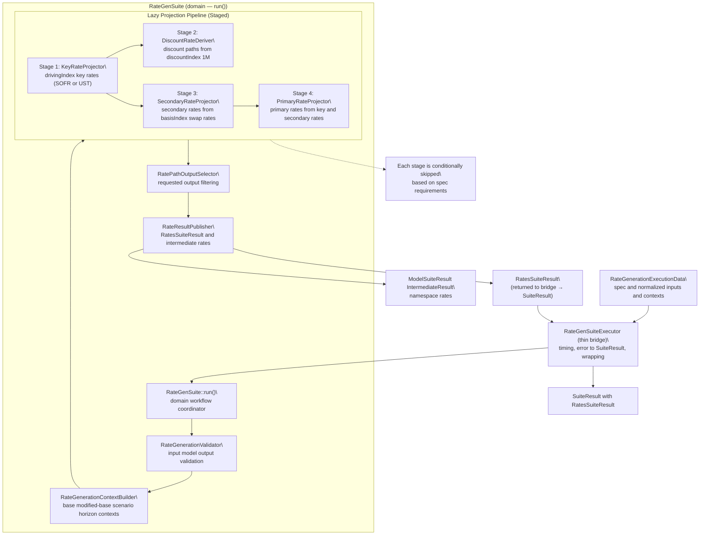
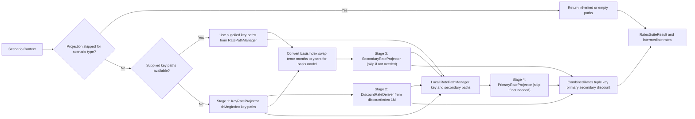
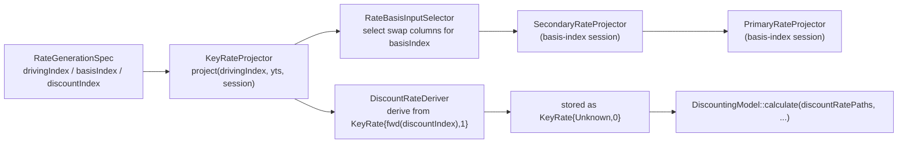
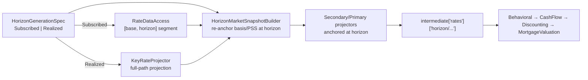
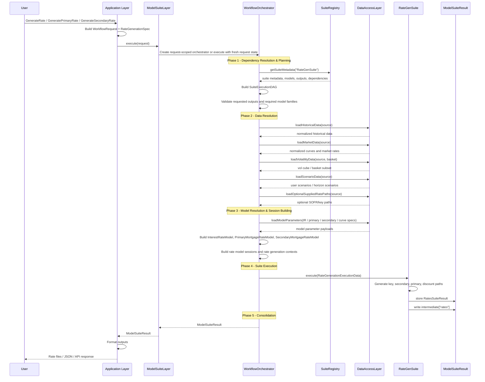
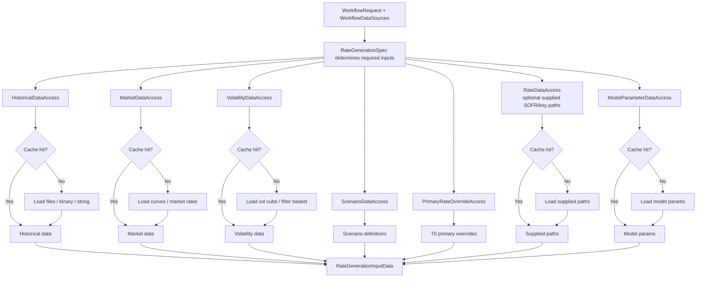
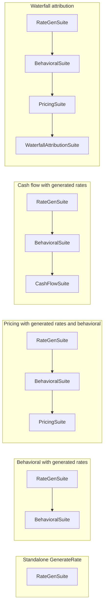
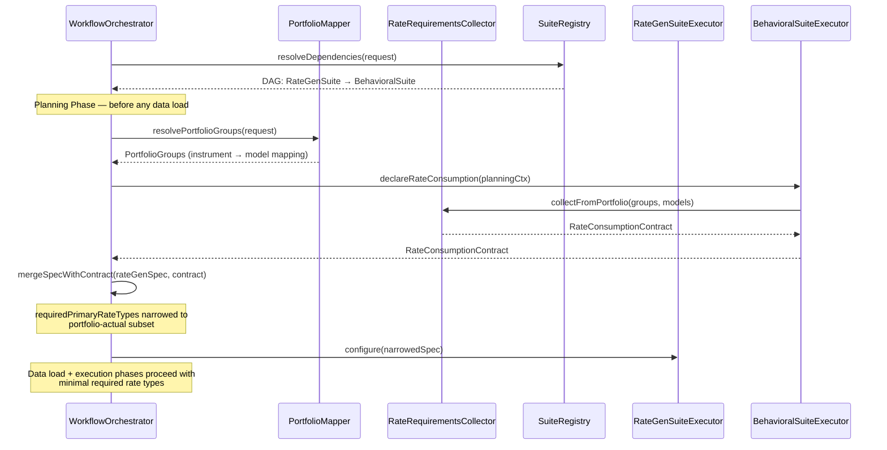
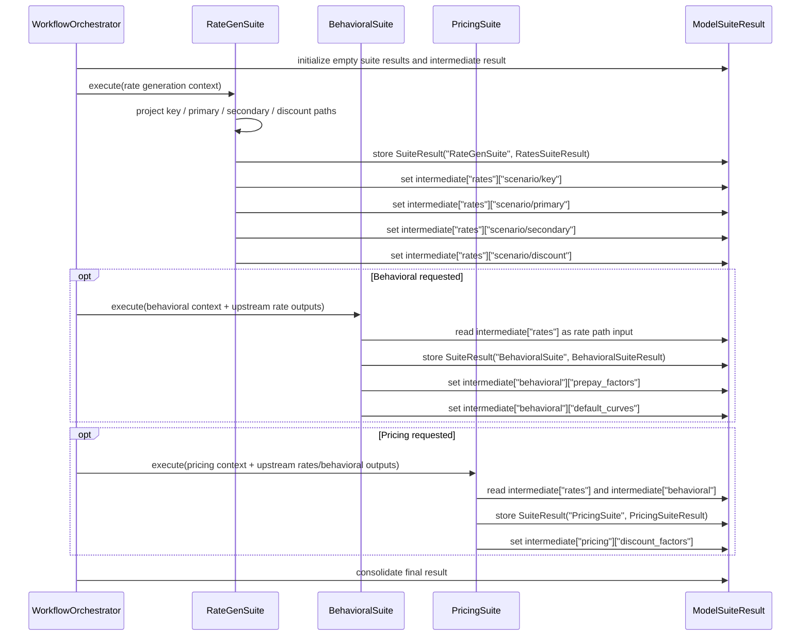
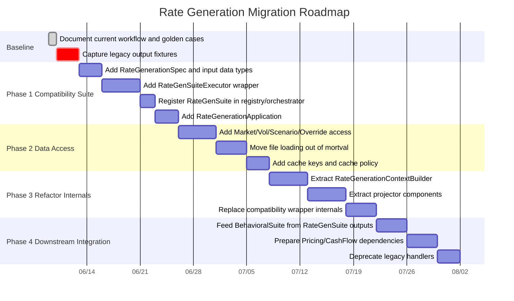

# Rate Generation Redesign for the Model Suite Framework

cp**Target framework:** New layered architecture with Presentation, Application, Model Suite, Data Access, common services, suite registry, DAG orchestration, and suite result contracts.  
**Status:** Base design + enhancements for efficiency, portfolio-driven inference, and extensibility

---

## Table of Contents

- [1. Summary](#1-summary)
- [2. Design Goals](#2-design-goals)
- [3. Proposed Layering](#3-proposed-layering)
  - [3.3 Plug-In Guide: Attach RateGenSuite to Existing Framework](#33-plug-in-guide-attach-rategensuite-to-existing-framework)
- [4. New Suite: `RateGenSuite`](#4-new-suite-rategensuite)
- [5. Proposed Request Model](#5-proposed-request-model)
- [6. Portfolio-Driven Rate Requirements Inference](#6-portfolio-driven-rate-requirements-inference)
- [6A. Driving / Basis / Discount Index Selection (Treasury Basis)](#6a-driving--basis--discount-index-selection-treasury-basis)
- [6B. Horizon Scenario Analysis (Subscribed vs Realized Rate Paths)](#6b-horizon-scenario-analysis-subscribed-vs-realized-rate-paths)
- [7. Proposed Data Access Layer Changes](#7-proposed-data-access-layer-changes)
- [8. Workflow Orchestrator Changes](#8-workflow-orchestrator-changes)
- [9. `RateGenSuiteExecutor` Design](#9-rategensuiteexecutor-design)
- [10. Rate Model Extensibility via Registries](#10-rate-model-extensibility-via-registries)
- [11. Result and Intermediate Contracts](#11-result-and-intermediate-contracts)
- [12. Suite Dependency Model](#12-suite-dependency-model)
- [13. Application Layer Redesign](#13-application-layer-redesign)
- [14. Migration Strategy](#14-migration-strategy)
- [15. Testing Plan](#15-testing-plan)
- [16. Risks and Mitigations](#16-risks-and-mitigations)
- [17. Recommended First Implementation Slice](#17-recommended-first-implementation-slice)
- [18. Key Design Decisions](#18-key-design-decisions)
- [19. Summary of New Components](#19-summary-of-new-components)
- [20. Concrete Registry Update (Drop-in Proposal)](#20-concrete-registry-update-drop-in-proposal)
- [21. Minimal Orchestrator Contract for Conditional Dependencies](#21-minimal-orchestrator-contract-for-conditional-dependencies)
- [22. Implementation Effort Estimate](#22-implementation-effort-estimate)

---

## 1. Summary

### 1.1 Core Principle

Rate generation should be migrated into the new model-suite framework as a main suite that creates rate outputs, named `RateGenSuite`.

`RateGenSuite` should own rate-domain workflow execution:

- selecting the **driving index** (SOFR / Treasury) used to generate key-rate paths
- SOFR/Treasury key-rate path generation
- **discount-rate derivation from the configured discount index** (SOFR 1M by default, Treasury 1M when the discount index is Treasury)
- primary mortgage rate projection
- secondary mortgage rate projection (optionally linked to a **Treasury basis model** when the basis index is Treasury)
- scenario and horizon rate path generation
- base/modified-base path assembly
- requested output filtering
- rate-generation diagnostics
- publishing generated paths for downstream suites

### 1.2 Key Enhancements

Analysis reveals three critical gaps in baseline rate generation that this redesign addresses:

#### Gap 1: Portfolio-Driven Rate Requirements Inference

In the current implementation, rate types are read from static CLI parameters (`RunConfig.ModelResolution.RequiredPrimRateTypes`, etc.). They are **not** derived from the portfolio's actual model composition. However, every behavioral model already declares its rate requirements precisely via `determineRequiredIndices()`. Rate generation should infer requirements from the portfolio and only generate what is actually consumed, eliminating wasted projections.

#### Gap 2: No Staged / Lazy Rate Projection Pipeline

`projectCombinedRatesSync` always runs the full sequence (key → discount → secondary → primary) regardless of what is needed. A request that only needs key rates still builds and runs the full primary and secondary model pipeline. The redesign introduces composable projectors with skip conditions for unused stages.

Concrete evidence in the current source confirms this:

1. **Projection runs before outputs are known; filtering happens after.** In `GenRatePathsForMortgageValuationRequestHandler.cpp:24` the handler always calls `projectRates` before it knows which outputs will be returned, and only later filters the response through `populateRequestedPaths` at `GenRatePathsForMortgageValuationRequestHandler.cpp:37`. In the shared path builder, `BaseRequestHandler.cpp:253` and `BaseRequestHandler.cpp:271` always invoke `projectCombinedRates`, so even a request that ultimately returns only swap or SOFR key-rate paths still runs key projection at `MortgageValuatorAsyncAdapter.cpp:372`, discount generation at `MortgageValuatorAsyncAdapter.cpp:380`, secondary projection at `MortgageValuatorAsyncAdapter.cpp:435`, and primary projection at `MortgageValuatorAsyncAdapter.cpp:445`. The returned response may only consume the swap-like `KeyRate` entries extracted at `BaseRequestHandler.cpp:709`, so the discount, secondary, and primary stages were computed but unused.

2. **Discount-only responses still pay for secondary and primary.** In the same `populateRequestedPaths` flow, a discount-only response extracts just the synthetic discount curve stored under `KeyRate` Unknown/0 at `BaseRequestHandler.cpp:733`. That discount curve is derived from SOFR at `MortgageValuatorAsyncAdapter.cpp:380`, but `projectCombinedRatesSync` does not stop there; it still proceeds into the secondary model at `MortgageValuatorAsyncAdapter.cpp:435` and then the primary model at `MortgageValuatorAsyncAdapter.cpp:445`. So a caller that needs only discount rates still pays for the full secondary and primary pipeline.

3. **Secondary-only responses still compute and discard primary.** A secondary-only response shows the same problem. `populateRequestedPaths` extracts `MortgageRateType` paths only when requested at `BaseRequestHandler.cpp:687`. But the upstream combined projection does not end after secondary rates are available. Once secondary rates are produced at `MortgageValuatorAsyncAdapter.cpp:435`, the code unconditionally inserts them into `localPaths` and immediately runs the primary model at `MortgageValuatorAsyncAdapter.cpp:440` and `MortgageValuatorAsyncAdapter.cpp:445`. If the request only returns secondary rates, the primary stage is computed and discarded.

4. **The fixed stage ordering has no per-output guard.** The fixed stage ordering is visible directly inside `MortgageValuatorAsyncAdapter.cpp:333`: after entering `projectCombinedRatesSync`, the function always follows the same sequence of key projection, discount derivation, secondary projection, then primary projection. The only skip logic in this function is the scenario-type gate at `MortgageValuatorAsyncAdapter.cpp:363`, which can skip the whole projection, but there is no stage-level guard based on whether the caller actually requested key rates only, discount rates only, or secondary rates only.

5. **The same pattern repeats across endpoints.** This is not limited to one endpoint. `GenRatePathsForWaterfallAttributionRequestHandler.cpp:18` and `CalcValueForMonthEndRollRequestHandler.cpp:19` also go through `projectRates` first and `populateRequestedPaths` afterward. That means any narrow `requestedOutput` set in those handlers still triggers the full combined sequence, even when only a subset of the generated rates is returned.

6. **Narrower entry points already exist but are not selected.** The strongest evidence that this is an orchestration problem rather than a modeling requirement is that narrower entry points already exist: `MortgageValuatorAsyncAdapter.cpp:477` provides a secondary-only path and `MortgageValuatorAsyncAdapter.cpp:513` provides a primary-only path. The shared request flow in `BaseRequestHandler.cpp:253` does not select among these based on requested outputs; it always chooses the combined projector. That is exactly the gap the redesign is addressing with composable projectors and skip conditions for unused stages.

A concise way to state the issue: the current design decides *what to return* **after** rate generation, while the redesign is intended to decide *what to generate* **before** entering the pipeline. In today's code, requests are filtered at `BaseRequestHandler.cpp:663` only after `projectCombinedRatesSync` has already built key, discount, secondary, and primary outputs. The redesign's composable projectors would move that decision earlier so unused stages can be skipped instead of computed and dropped.

#### Gap 3: Closed Factory for Interest Rate Models

`InterestRateModelBuilder::build()` contains a `switch` on `InterestRateModelType`. Adding a new IR model variant requires editing closed factory code. The redesign introduces extensible registry pattern for all three rate model families (IR, primary mortgage, secondary mortgage).

#### Gap 4: Hardcoded SOFR Driving and Discount Index

Although the core `InterestRateModel` is already index-generic (`InterestRateType { Sofr, Libor, Treasury }`, with `swapRateType()` / `forwardRateType()` already mapping `Treasury -> ProductType::Treasury`), the orchestration layer hardcodes SOFR in three seams inside `MortgageValuatorAsyncAdapter::projectCombinedRatesSync`:

1. **Generation** is fixed to `irModel->project(InterestRateType::Sofr, ...)`. Treasury is only ever produced as an auxiliary set of extra key-rate columns (gated on a `TreasuryCurveInput`), never as the driving index.
2. **Basis input** feeds the secondary/primary (basis) models only from `ProductType::SofrSwap` columns. There is no path for a Treasury-driven basis model.
3. **Discounting** derives the discount path from `KeyRate{ProductType::Sofr, 1}` and the `DiscountingModel::calculate(...)` contract takes a parameter literally named/typed `sofr1mRatePaths`. `MortgageValuator`, `Profitability`, and `CashFlowDriver` all extract `KeyRate{ProductType::Sofr, 1}` directly.

This blocks the requirement to **"use the Treasury curve to generate rate paths, link it to a Treasury basis model, and use Treasury to discount the cash flows"** (an option PolyPaths already exposes via its `rate_type` selector). The redesign makes the **driving index**, **basis index**, and **discount index** first-class, spec-driven parameters that flow generate -> basis -> discount, rather than bolting Treasury on as a parallel special case. See Section 6A below for the design.

The Application Layer should only adapt CLI/API inputs into a `WorkflowRequest` plus `RateGenerationSpec`, delegate to `ModelSuiteLayer`, and format output. The Data Access Layer should become the single entry point for all source data and cacheable reference inputs. The Workflow Orchestrator should resolve the `RateGenSuite` DAG, prepare common request data, and execute `RateGenSuiteExecutor` without requiring portfolio-specific behavioral preparation.

---

## 2. Design Goals

1. **Preserve existing numerical behavior**
   - Initial migration should wrap existing `ScenarioManager` and `MortgageValuatorAsyncAdapter` logic.
   - Refactoring should be behavior-preserving before introducing algorithmic changes.

2. **Make rate generation a model suite**
   - Rate generation is not just a common helper. It has domain models, sessions, scenarios, output contracts, diagnostics, and downstream dependencies.

3. **Keep Application Layer thin**
   - No file parsing, model compatibility logic, scenario orchestration, or output selection logic in `mortval` application functions.

4. **Centralize data loading**
   - All market, historical, volatility, scenario, override, and supplied path inputs should go through Data Access Layer components.

5. **Publish reusable suite outputs**
   - Generated rate paths should be available through `ModelSuiteResult` and `IntermediateResult` so Behavioral, Pricing, CashFlow, Waterfall, and Greeks suites can consume them.

6. **Support all current run modes through one suite**
   - Combined rate paths
   - primary-only paths
   - secondary-only paths
   - scenario paths
   - waterfall attribution paths
   - valuation-from-rates integration

---

## 3. Proposed Layering

### 3.2 Reuse Contract with Overall Model-Suite Workflow

This redesign **reuses** the same end-to-end workflow architecture defined in `proposed_design.md`.
`RateGenSuite` is an additional suite inside that architecture, not a parallel framework.

What is reused as-is:

- **Presentation Layer**: existing CLI/C API setup, config parsing, and request entry points.
- **Application Layer**: thin request adapter + output formatter pattern; no domain logic.
- **ModelSuiteLayer facade**: single `execute(request)` entry point.
- **WorkflowOrchestrator lifecycle**: request-scoped orchestrator, DAG planning, topological execution.
- **SuiteRegistry contract**: declarative dependencies, metadata, and versioned suite definitions.
- **DataAccessLayer pattern**: single data boundary with integrated cache strategy (L1/L2/L3), source abstraction, and normalized payloads.
- **ModelSuiteResult contract**: suite outputs + namespaced intermediate results for downstream suites.

What is extended for rate generation:

- New suite metadata and executor for `RateGenSuite`.
- New rate-specific request payload (`RateGenerationSpec`) and normalized inputs.
- New rate-domain projector components inside the suite.
- New rate consumption contract/collector for portfolio-driven requirement narrowing.

Non-goal:

- No new orchestration engine, no separate caching subsystem, and no additional application layer.
- All rate-generation flow remains under the existing orchestrator and data access boundaries.

### 3.3 Plug-In Guide: Attach `RateGenSuite` to Existing Framework

This section is the implementation bridge between this redesign and the baseline framework in `proposed_design.md`.

#### Integration Entry Points

1. **Application Layer (reuse)**
  - Keep the same thin application pattern.
  - Map run-mode/config inputs into `WorkflowRequest + RateGenerationSpec`.
  - Delegate to `ModelSuiteLayer::execute(request)`; do not add domain logic.

2. **Workflow Orchestrator (reuse + extension)**
  - Reuse request-scoped orchestrator lifecycle and DAG resolution.
  - Register `RateGenSuite` factory in default suite executors.
  - Add conditional dependency rules so downstream suites can require `RateGenSuite` when generated rates are requested.

3. **Data Access Layer (reuse + extension)**
  - Add rate-specific access objects only as new DAL components (market, vol, scenario, overrides, supplied paths).
  - Keep rate generation code free of direct file/db/cache logic.

4. **Suite Result Contract (reuse + extension)**
  - Reuse `ModelSuiteResult` as the single inter-suite exchange contract.
  - Publish `RatesSuiteResult` plus namespaced intermediates (`intermediate["rates"][...]`).
  - Downstream suites read from intermediates; suites do not call each other directly.

#### Step-by-Step Plug-In Sequence

1. Add `RateGenSuite` metadata to Suite Registry (`suiteId`, outputs, model families, dependency rules).
2. Extend request contracts (`RateGenerationSpec`, `RateGenerationInputData`, workflow source refs).
3. Register `RateGenSuiteExecutor` in orchestrator default factory map.
4. Add orchestrator preparation hook (`prepareRateGenerationContext`) inside existing phase pipeline.
5. Run `RateGenSuite` via existing DAG topological execution.
6. Publish outputs into `ModelSuiteResult` (`SuiteResult + intermediate["rates"]`).
7. Wire consumers (`BehavioralSuite`, `PricingSuite`, `CashFlowSuite`, `Waterfall`) to read `intermediate["rates"]`.
8. Gate rollout behind feature flag and validate parity with golden tests before legacy cutover.

#### Reused vs New Components

| Area | Reused from existing framework | New for rate redesign |
|---|---|---|
| Presentation/Application | CLI/C API entry, thin request mapping, output formatting pattern | `RateGenerationApplication` adapter wiring |
| Orchestration | Request-scoped `WorkflowOrchestrator`, DAG, topological execution, dependency resolution model | `RateGenSuite` registration + rate requirement merge hooks |
| Data Access | Single DAL boundary, cache hierarchy, source abstraction, normalization pipeline | Rate-specific access components and source specs |
| Suite Execution | `SuiteExecutor` contract, `ExecutionContext` model | `RateGenSuiteExecutor` + staged projectors |
| Inter-suite Data | `ModelSuiteResult` + namespaced intermediate pattern | `rates` namespace shape and `RatesSuiteResult` extension |

#### Backward Compatibility Guardrails

- Keep SOFR defaults (`drivingIndex_`, `basisIndex_`, `discountIndex_`) to preserve current numerical behavior.
- Keep existing handler/API output shape; changes are internal to orchestration and suite execution.
- Use feature flag (`--use-legacy-rate-generation`) for staged rollout and fast rollback.
- Require golden output parity for legacy SOFR scenarios before enabling Treasury-index options broadly.

```text
Presentation Layer
  - mortval CLI / C API handles
  - RunConfig parsing
  - library setup/teardown

Application Layer
  - RateGenerationApplication
  - RateGenerationRequestAdapter
  - RateGenerationOutputFormatter
  - no business logic

Model Suite Layer
  - ModelSuiteLayer facade
  - WorkflowOrchestrator
  - SuiteRegistry
  - SuiteExecutionDAG
  - RateGenSuiteExecutor
  - RateGenerationContextBuilder
  - Rate path projector services

Data Access Layer
  - HistoricalDataAccess
  - MarketDataAccess
  - VolatilityDataAccess
  - ScenarioDataAccess
  - RateDataAccess
  - ModelParameterDataAccess
  - PrimaryRateOverrideAccess
  - cache key strategy and cache hierarchy

Core Models / Domain Services
  - InterestRateModel
  - PrimaryMortgageRateModel
  - SecondaryMortgageRateModel
  - Curve builders/interpolators
  - CommonRateService helpers
```

### 3.1 Layered Rate Generation Architecture


---

## 4. New Suite: `RateGenSuite`

### 4.1 Suite Identity

> **Integration note:** `SuiteType::RateGen` already exists in the suite-type enum, and
> `SuiteResult`'s `std::variant` already includes a "rates" alternative. This redesign adds the
> `RateGenSuite` *executor* and its registry entry on top of those existing slots — no new enum
> member or result-variant alternative is required.

Suggested registry entry:

```json
{
  "suiteId": "RateGenSuite",
  "suiteName": "Rate Generation Suite",
  "version": "1.0.0",
  "description": "Generates key, primary, secondary, discount, and scenario rate paths for mortgage analytics.",
  "dependencies": [],
  "outputs": [
    "key_rate_paths",
    "primary_rate_paths",
    "secondary_rate_paths",
    "discount_rate_paths",
    "scenario_rate_paths",
    "hpi_paths",
    "unemployment_paths",
    "scenario_market_data"
  ],
  "models": {
    "InterestRateModel": {
      "defaultModelVersion": "current"
    },
    "PrimaryMortgageRateModel": {
      "defaultModelVersion": "current"
    },
    "SecondaryMortgageRateModel": {
      "defaultModelVersion": "current"
    },
    "CurveBuilder": {
      "defaultModelVersion": "current"
    },
    "CurveInterpolation": {
      "defaultModelVersion": "current"
    }
  }
}
```

### 4.2 Suite Responsibilities

`RateGenSuite` owns:

- validating required rate inputs and model combinations
- resolving whether to use supplied SOFR paths or generate paths
- inferring portfolio-driven rate requirements when a behavioral/pricing suite is downstream
- creating rate generation contexts
- projecting key rates through `InterestRateModel`
- converting SOFR swap tenor units for secondary model compatibility
- projecting secondary rates from key-rate paths (when needed)
- projecting primary rates from key and secondary paths (when needed)
- generating discount-rate paths from SOFR 1M paths (when needed)
- applying scenario/horizon logic
- packaging output into `RatesSuiteResult`
- publishing reusable path sets to intermediate results

### 4.3 Suite Non-Responsibilities

`RateGenSuite` should not:

- read files directly
- parse CLI arguments
- write files directly
- own process-scoped registry state
- mutate portfolio objects
- embed output formatting rules for CLI file layout
- directly call downstream suites

### 4.4 RateGenSuite Internal Component Chart



### 4.4.1 Component Walkthrough

This chart describes a factory-style workflow that turns raw market and scenario inputs into reusable rate paths.

Think of it as a seven-step assembly line:

1. **Receive input package** (`RateGenerationExecutionData`)
   - Contains the run spec (what to generate), normalized input data, and scenario contexts.
   - Plain meaning: the full job ticket plus all required ingredients.

2. **`RateGenSuiteExecutor` (thin bridge) → `RateGenSuite::run()` (domain)**
   - The executor is a thin transport bridge (mirrors `BehavioralSuiteExecutor`): it only measures timing, translates a `LibException` into a failed `SuiteResult`, and wraps the domain result. It owns no projectors, validation, or publishing.
   - It constructs a `RateGenSuite` and calls `run(context)`. `RateGenSuite::run()` is the actual coordinator that decides the call order, triggers each component, and gathers outputs.
   - Plain meaning: the executor is the receptionist; `RateGenSuite` is the workflow manager.

3. **`RateGenerationValidator` (Validator)**
   - Runs early checks before expensive computation starts.
   - Confirms required inputs exist, model selections are compatible, and requested outputs are valid.
   - Fails fast with actionable errors when configuration is inconsistent.
   - Plain meaning: quality control at the front door.

4. **`RateGenerationContextBuilder` (CtxBuilder)**
   - Creates execution contexts for base, modified-base, scenario, and horizon runs.
   - Assembles per-run state each model needs (dates, sessions, scenario flags).
   - Plain meaning: prepares workstations before production begins.

5. **Lazy Projection Pipeline (`Pipeline`)**
   - Core math chain, split into stages that can be skipped if not needed.
   - Plain meaning: only run the expensive steps that the request actually needs.

   **Stage 1: `KeyRateProjector`**
   - Generates benchmark key-rate paths from the selected driving index (SOFR or Treasury).
   - Key rates are anchor rates at specific tenors (for example 1M, 3M, 2Y, 10Y).
   - Why it matters: later stages typically depend on these paths.

   **Stage 2: `DiscountRateDeriver`**
   - Derives discount-rate paths from the selected discount index short rate (typically 1M).
   - Discount rates convert future cash flows into present value.
   - Why it matters: pricing and valuation require these paths even when some mortgage-rate outputs are not requested.

   **Stage 3: `SecondaryRateProjector`**
   - Uses key-rate inputs to project secondary mortgage rates (market side).
   - Can apply basis-index-specific swap column selection and tenor conversion.
   - Why it matters: downstream pricing and some primary models depend on these market-linked rates.

   **Stage 4: `PrimaryRateProjector`**
   - Uses key and secondary rates to project primary mortgage rates (borrower offer side).
   - Why it matters: behavioral and origination analytics usually consume primary paths.

6. **`RatePathOutputSelector` (Selector)**
   - Filters and shapes outputs to exactly what the caller requested.
   - Keeps base vs. scenario outputs separated and excludes unrequested artifacts.
   - Plain meaning: package only what was ordered.

7. **`RateResultPublisher` (Publisher)**
   - Publishes results to `SuiteResult` (`RatesSuiteResult`) for direct suite consumers.
   - Publishes results to `ModelSuiteResult.IntermediateResult` under `rates` for downstream suites.
   - Plain meaning: send both the final report and reusable internal data.

#### Why the "Lazy" design matters

- If a run only needs key rates, Stage 3 and Stage 4 can be skipped.
- If a run only needs discounting, mortgage-rate projection stages can be skipped.
- This reduces CPU, memory, and wall-clock time without changing requested outputs.

### 4.5 Rate Generation Projection Pipeline (Lazy Stages)



### 4.6 Stage Skip Rule (Derived, Not Mode-Based)

Stages are not driven by a run-mode enum. Each stage runs **iff** its output
family is required — directly via `requestedOutputs_`, or transitively (primary
needs key + secondary; secondary and discount need key) — **and** that family is
not prescribed (supplied via `prescribed_`). For a stage producing family `F`:

```text
run(stage_F) = requires(F) && !prescribed_.F
```

where `requires(F)` is the transitive closure of the requested outputs. The old
per-mode rows fall out of this single rule; representative combinations:

| Requirement (requested + prescribed) | Stage 1 (key) | Stage 2 (discount) | Stage 3 (secondary) | Stage 4 (primary) |
|---|:---:|:---:|:---:|:---:|
| Key rates only, key prescribed | skip | cond. | skip | skip |
| Key rates only, generated | run | cond. | skip | skip |
| Secondary only | run | skip | run | skip |
| Primary only | run | skip | run | run |
| Combined (full) | run | cond. | run | run |
| Combined, discount required (e.g. attribution) | run | run | run | run |
| Portfolio-driven subset | run | cond. | subset | subset |
| Secondary prescribed, primary generated | run | skip | skip | run |

`cond.` = Stage 2 runs only when `requiresDiscountRates()` is true.

Two consequences of the derived rule, matching the review comments:

- The former **"Waterfall attribution"** row is not special — it is simply
  "Combined with discount required." Waterfall is a *consumer*, not a distinct
  rate-generation mode, so it no longer appears as its own row. (Today
  `GenerateRateForWaterfallAttribution` is a distinct `RunMode` with entry point
  `calcWaterfallAttributeRates`; collapsing it is a CLI-mode removal tracked in Phase 5.)
- **Prescribed** and **generated** families can mix per row (last row), which a
  single flat `Mode`/`ValuationFromRates` value could not express.

---

## 5. Proposed Request Model

### 5.1 Extend `WorkflowRequest`

Add a rate-specific spec rather than overloading behavioral fields.

```cpp
struct RateGenerationSpec {
    // Which rate families are supplied externally (prescribed) instead of
    // model-generated. Anything not listed here is generated. This replaces both
    // the old `useSuppliedSofrPaths_` flag and the `ValuationFromRates` mode, and
    // — unlike a single flat mode value — can express mixed runs (for example
    // secondary prescribed while primary is still generated from it).
    struct PrescribedRateInputs {
        bool keyRates       = false;  // supplied key / driving-index paths
        bool secondaryRates = false;  // supplied secondary mortgage rates
        bool primaryRates   = false;  // supplied primary mortgage rates
        // discount is always derived from the discount index, never prescribed alone
        bool any() const { return keyRates || secondaryRates || primaryRates; }
    };

    // NOTE: there is intentionally no `Mode` enum. It previously conflated three
    // orthogonal axes; each now has a dedicated home:
    //   * scope   ("which rate families to produce") -> requestedOutputs_ /
    //              the portfolio-driven RateConsumptionContract
    //   * source  ("generated vs prescribed")        -> prescribed_ below
    //   * purpose ("waterfall / scenario / valuation") -> NOT a rate-generation
    //              concern; it lives in the consuming suite / orchestration layer
    // Waterfall attribution is therefore just portfolio-driven combined
    // generation with discount rates required; valuation-from-rates is just a
    // request whose prescribed_ set is non-empty. See §4.6.
    PrescribedRateInputs prescribed_;
    size_t simulationMonths_ = 0;

    // NEW: index selection (Gap 4). Defaults preserve current SOFR behavior.
    //   drivingIndex_  — which curve/model generates key-rate paths
    //   basisIndex_    — which swap curve feeds the secondary/primary (basis) models
    //   discountIndex_ — which index the discount path is derived from
    // When drivingIndex_ == Treasury, the IR model projects Treasury key rates as the
    // primary output; when basisIndex_ == Treasury the basis model is linked to the
    // Treasury basis; when discountIndex_ == Treasury the discount path uses Treasury 1M.
    InterestRateType drivingIndex_  = InterestRateType::Sofr;
    InterestRateType basisIndex_    = InterestRateType::Sofr;
    InterestRateType discountIndex_ = InterestRateType::Sofr;

    std::set<PathOutputType> requestedOutputs_;

    std::pmr::vector<PrimaryRateType> requiredPrimaryRateTypes_;
    std::pmr::vector<MortgageRateType> requiredSecondaryRateTypes_;
    std::pmr::vector<Tenor> requiredSofrSwapTenors_;
    std::pmr::vector<Tenor> requiredUstSwapTenors_;

    app::messages::DateSpec dateSpec_;
    app::messages::GreekSpec greekSpec_;
    bool riskFactorDerivativeCalc_ = false;
    bool printScenarioSnapshot_ = false;

    bool includeScenarioMarketData_ = false;

    // NEW: when true, required rate types are inferred from the portfolio
    // rather than taken from this spec's required*_ vectors.
    // The orchestrator fills in required*_ after portfolio analysis.
    bool inferRequirementsFromPortfolio_ = false;

    // NEW: when true, skip a projection stage if the spec says it is not needed
    // (defaults to true — safe to disable for debugging / regression comparison)
    bool enableStagedProjection_ = true;

    // Helper to determine if discount rates are needed
    bool requiresDiscountRates() const {
        return requestedOutputs_.contains(PathOutputType::BaseDiscountRates) ||
               requestedOutputs_.contains(PathOutputType::DiscountRates);
    }
};
```

`WorkflowRequest` should then include:

```cpp
std::optional<RateGenerationSpec> rateGenerationSpec_;
EmbeddedPayload<RateGenerationInputData> rateGenerationInput_;
```

### 5.2 Data Sources

Extend `WorkflowDataSources`:

```cpp
struct WorkflowDataSources {
    std::optional<PortfolioSource> portfolioSource;
    std::optional<RateSource> rateSource;
    std::optional<HistoricalDataSource> historicalSource;

    std::optional<MarketDataSource> marketSource;
    std::optional<VolatilityDataSource> volatilitySource;
    std::optional<ScenarioDataSource> scenarioSource;
    std::optional<PrimaryRateOverrideSource> primaryRateOverrideSource;
    std::optional<GreekSpecSource> greekSpecSource;
};
```

### 5.3 Application Adapter

Create:

- `cc/src/app-layer/RateGenerationApplication.h/.cpp`
- `cc/src/app-layer/RateGenerationRequestAdapter.h/.cpp`
- `cc/src/app-layer/RateGenerationOutputFormatter.h/.cpp`

`RateGenerationRequestAdapter` should map `RunConfig` into:

- `WorkflowRequest::requestedSuites_ = {"RateGenSuite"}`
- `WorkflowRequest::rateGenerationSpec_`
- source references in `WorkflowDataSources`
- execution control flags
- request ID

It should not read the files directly.

---

## 6. Portfolio-Driven Rate Requirements Inference

### 6.1 Problem

When `RateGenSuite` runs as a dependency of `BehavioralSuite` or other portfolio-bearing suites, it should only project the rate types that the portfolio's behavioral models actually consume. However, there is currently no path from `determineRequiredIndices()` to the rate generation step. Rate generation projects the full configured set regardless of what the portfolio actually needs.

### 6.2 RateConsumptionContract

Introduce a formal contract type that downstream suites use to declare their rate dependencies:

```cpp
// cc/src/core/model-suite/RateConsumptionContract.h

struct RateConsumptionContract {
    // Key rate tenors needed (empty = none needed / supplied externally)
    std::set<KeyRate> requiredKeyRates;

    // Primary rate types needed
    std::set<PrimaryRateType> requiredPrimaryRateTypes;

    // Secondary/mortgage rate types needed
    std::set<MortgageRateType> requiredSecondaryRateTypes;

    // Whether discount rates are needed (derived from the discount index)
    bool requiresDiscountRates = false;

    // Whether UST rates are needed
    std::set<KeyRate> requiredUstKeyRates;

    // NEW (Gap 4): index preferences declared by the consuming suite.
    // A downstream suite (e.g. a Treasury-discounted pricing run) can require a
    // specific discount / driving / basis index. std::nullopt means "no preference —
    // inherit the request-level RateGenerationSpec default". When multiple contracts
    // are absorbed, a non-null preference must be consistent; conflicting index
    // requirements are a validation error at plan time.
    std::optional<InterestRateType> drivingIndex;
    std::optional<InterestRateType> basisIndex;
    std::optional<InterestRateType> discountIndex;

    // Merge another contract in-place (union semantics; index preferences must agree)
    void absorb(const RateConsumptionContract& other);

    // Produce a RateGenerationSpec from this contract
    RateGenerationSpec toSpec() const;
};
```

### 6.3 Suite-Level Rate Contract Declaration

Add an optional method to `SuiteExecutor`:

```cpp
// cc/src/core/model-suite/SuiteExecutor.h

class SuiteExecutor {
public:
    virtual ~SuiteExecutor() = default;

    // Matches the real framework interface (see BehavioralSuiteExecutor):
    // an executor is a thin bridge that returns a single SuiteResult; the
    // orchestrator assembles the ModelSuiteResult from all suite results.
    virtual std::string getSuiteId() const = 0;
    virtual SuiteResult execute(const ExecutionContext& context) = 0;
    virtual void validate(const ExecutionContext& context) const = 0;

    /**
     * Optionally declare rate requirements before execution.
     *
     * Called by the WorkflowOrchestrator during planning phase,
     * before RateGenSuite is configured. Returning std::nullopt
     * means "no declaration — use externally specified rates".
     *
     * @param context Partial execution context (portfolio + model map available;
     *                rate paths not yet available)
     */
    virtual std::optional<RateConsumptionContract>
    declareRateConsumption(const PlanningContext& context) const {
        return std::nullopt;
    }
};
```

### 6.4 RateRequirementsCollector

Add a component in the orchestrator that aggregates requirements from the portfolio before the RateGenSuite spec is finalized:

```cpp
// cc/src/core/model-suite/RateRequirementsCollector.h

class RateRequirementsCollector {
public:
    /**
     * Walk the portfolio's instrument groups, call determineRequiredIndices()
     * on each paired model, and union the results into one contract.
     *
     * This is used by WorkflowOrchestrator::prepareExecutionContext()
     * when RateGenSuite is a dependency and the requesting suite is
     * portfolio-bearing (e.g., BehavioralSuite, PricingSuite).
     */
    static RateConsumptionContract collectFromPortfolio(
        const PortfolioGroups& groups,
        const ModelCollection& models);

    /**
     * Accept an explicit contract declared by a suite executor.
     * Used when the suite cannot walk the portfolio statically
     * (e.g., CashFlowSuite which reads behavioral intermediates).
     */
    static RateConsumptionContract merge(
        std::span<const RateConsumptionContract> contracts);
};
```

Implementation note: `collectFromPortfolio` calls `model.determineRequiredIndices(group.instruments)` for each `(model, group)` pair and accumulates results. This is the same mechanism the existing `ScenarioManager` uses, but exposed at the orchestrator level so it happens before rate generation rather than after.

### 6.5 Tenor Subsetting

`determineRequiredIndices()` already returns specific `KeyRate{ProductType, tenor}` values with exact tenor months. This can be used to filter which SOFR/UST swap-rate columns are projected by `InterestRateModel::project`. The fix is to pass the union of portfolio-required tenors rather than the full configured set. (Request-level `setRequiredSofrSwapTenors` / `setRequiredTreasuryTenors` exist; verify the exact tenor parameter name on `InterestRateModel::project` before wiring.)

```
Current:  requiredSofrSwapTenors = {1m, 3m, 6m, 1y, 2y, 3y, 5y, 7y, 10y, 20y, 30y}
          → Monte Carlo projects all 11 tenor paths
Improved: requiredSofrSwapTenors = {1m, 3m, 2y}  (only what models in portfolio need)
          → Monte Carlo projects only 3 tenor paths  (significant speedup for large simulations)
```

---

## 6A. Driving / Basis / Discount Index Selection (Treasury Basis)

This section addresses Gap 4. It makes the index that drives generation, feeds the basis
model, and derives discounting a first-class, spec-driven concept, so a user can choose to
generate rate paths off the Treasury curve, link them to a Treasury basis model, and discount
cash flows on Treasury — the option PolyPaths already exposes.

### 6A.1 Three Independent Index Roles

The redesign separates three roles that are currently all implicitly SOFR:

| Role | Spec field | Meaning | Today |
|---|---|---|---|
| Driving index | `RateGenerationSpec::drivingIndex_` | Curve/model that generates key-rate paths | Hardcoded `Sofr` (`projectCombinedRatesSync` L372) |
| Basis index | `RateGenerationSpec::basisIndex_` | Swap curve feeding the secondary/primary basis models | Only `SofrSwap` columns (L410-429) |
| Discount index | `RateGenerationSpec::discountIndex_` | Index the discount path is derived from | Hardcoded `Sofr` 1M (L380-404, `MortgageValuator` L125) |

The roles are independent on purpose: a common configuration is to **generate and discount on
Treasury** while still consuming a Treasury-linked basis, but the design does not force them to
move together. Defaults are all `Sofr`, so existing runs are numerically unchanged.

These three fields already exist on `RateGenerationSpec` (Section 5.1) and can be requested by a
downstream suite through the optional `drivingIndex` / `basisIndex` / `discountIndex` preferences
on `RateConsumptionContract` (Section 6.2).

### 6A.2 Generalizing the Driving Index

`InterestRateModel::project` already accepts an `InterestRateType`, and
`InterestRateModel::swapRateType()` / `forwardRateType()` already map
`Treasury -> ProductType::Treasury`. The call-site change is small: `KeyRateProjector` must pass
`spec.drivingIndex_` instead of the literal `InterestRateType::Sofr`, and the yield term structure
and IR session must be selected for that index. SOFR uses the `YieldTermStructure` built by
`SofrSwapCurveFactory` plus the SOFR `InterestRateSession`; Treasury uses a `FittedBondDiscountCurve`
(NSS/cubic-spline, built by `FittedBondDiscountCurveFactory`) plus a Treasury `InterestRateSession`.

> **Feasibility caveat (verified against repository context):** `InterestRateType::Treasury` and
> `ProductType::Treasury` exist in the public enums, but the Monte-Carlo generation path is not yet
> Treasury-capable. `VolMatrixCalibrator` is constructed only for SOFR/LIBOR, the calibration
> objective is built from `calcSofrSwapRate` and `AnalyticalSwaption`, and `ConstructConstantPath`
> is SOFR-only (`ConstructStaticForwardPath` already accepts a `rateType`). Treasury driving
> therefore also needs Treasury vol-calibration and Treasury swap-rate math — covered by the added
> workstream in Section 22.1. Today `setRequiredTreasuryTenors` / `setMarketUSTreasuryCurveInput`
> are auxiliary output columns, not a driving-index path.

```
drivingIndex_ = Sofr      → project(Sofr,     sofrYts, sofrSession, ...)   [unchanged default]
drivingIndex_ = Treasury  → project(Treasury, ustYts,  ustSession,  ...)   [new primary path]
```

The current auxiliary Treasury-columns block (`projectCombinedRatesSync` L451-465) collapses into
this single generalized call: instead of always projecting SOFR and *optionally appending* UST
columns, the projector projects the driving index once. Non-driving indices remain available as
optional extra output columns when explicitly requested via `requestedOutputs_`.

### 6A.3 Linking the Basis Model to Treasury

The basis-input assembly currently filters for `ProductType::SofrSwap` only. It becomes a
`RateBasisInputSelector` keyed on `spec.basisIndex_`:

| `basisIndex_` | Swap product type selected for the basis model | Tenor conversion |
|---|---|---|
| `Sofr` | `ProductType::SofrSwap` | months → years (as today) |
| `Treasury` | `ProductType::Treasury` (swap tenors) | months → years |

> `InterestRateType::Libor` (`ProductType::LiborSwap`) remains in the enum for legacy compatibility but is **retired** and not offered as a selectable driving/basis index.

The selector produces the `tempRateManagerForBasisModel` that feeds `projectSecondaryRates` and
then `projectPrimaryRates`, unchanged downstream. The secondary/primary model **sessions** must be
built against the chosen basis index so the basis parameters (a Treasury basis model vs. a SOFR
basis model) match. Model selection stays a Data Access / model-resolution concern — the basis
index only selects which curve columns and which basis-model parameter set are wired in.

> **Historical-data caveat:** basis sessions are built by pulling historical swap rates, swaption
> vols, and mortgage rates from context (`extractHistoryDataFromContext`), and the data providers
> expose `historicalSofrRates` / `historicalLiborRates` but no UST rate index. A Treasury basis
> model therefore also needs a Treasury historical-swap series and a Treasury basis parameter set;
> these are part of the added Section 22.1 workstream rather than "only wiring curve columns".

> **Validation:** at plan time, `RateGenSuiteExecutor::validate` must confirm the resolved
> secondary/primary models can consume the chosen `basisIndex_` (via `RateModelCapabilities`,
> Section 10.5). Requesting a Treasury basis with a SOFR-only basis model fails fast.

### 6A.4 Generalizing the Discount Stage

This is the one genuinely invasive change: the discount contract is currently typed as SOFR 1M.

Current (SOFR-locked):

- Discount path derived from `KeyRate{ProductType::Sofr, 1}`, stored as `KeyRate{Unknown, 0}`.
- `DiscountingModel::calculate(..., matrix_view<double> sofr1mRatePaths, ...)`.
- `MortgageValuator` / `Profitability` / `CashFlowDriver` read `KeyRate{ProductType::Sofr, 1}`
  directly.

Redesigned (index-generic):

- `DiscountRateDeriver` derives the discount path from `KeyRate{ forwardRateType(discountIndex_), 1 }`
  (SOFR 1M by default, Treasury 1M when `discountIndex_ == Treasury`). The derived path continues
  to be stored under the neutral `KeyRate{ProductType::Unknown, 0}` key, so the storage contract is
  unchanged.
- The discounting API parameter `sofr1mRatePaths` is renamed/generalized to `discountRatePaths`
  (a discount-index 1M path). This is a **breaking interface change** across
  `DiscountingModel::calculate` and the `Poly` / `Busch` / `Xva` implementations, so it is gated
  behind characterization tests (Section 15) that compare pre/post output for SOFR discounting.
- Consumers (`MortgageValuator`, `Profitability`, `CashFlowDriver`) read the neutral discount key
  (`KeyRate{Unknown, 0}`) or `KeyRate{ forwardRateType(discountIndex_), 1 }` rather than a literal
  `Sofr, 1`.

Because the derived discount path is already stored under `KeyRate{Unknown, 0}`, most downstream
code can switch to that neutral key with no behavioral change; only the explicit
`KeyRate{ProductType::Sofr, 1}` lookups need generalization.

### 6A.5 Index Flow Summary



### 6A.6 PolyPaths Bridge Alignment

PolyPaths already distinguishes the index it supplies via its `rate_type` selector
(`ccLogging` map in `Path.cpp`: `1=lb, 2=ust, 3=agcy, 4=fn, 7=sofr, 5=sofr_scn`). When the bridge
supplies Treasury swap rates, `basisIndex_` should be set to `Treasury` so the library's basis
projection and discounting line up with the rates PolyPaths hands in. This keeps the redesigned
index concept consistent between the native `RateGenSuite` path and the PolyPaths bridge path.

---

## 6B. Horizon Scenario Analysis (Subscribed vs Realized Rate Paths)

### 6B.1 Purpose

PolyPaths-style horizon analysis values a portfolio from a future **horizon date** rather than the
valuation date: rates are known (or prescribed) up to the horizon, and the model projects forward
from there. The bridge expresses this today via `ScenarioType` (`Base`/`IpHorizon`/`WfhlHorizon`/
`CibInstant`) and `HorizonGenType` (`ScnBased`/`FileBased`/`RealizedFwd`) on `Bond`, with per-`Bond`
and per-`Run` horizon calibration caches
([ppbridge](.github/pando_context/pando_context/modules/ppbridge.md)).

Horizon analysis is **not a new suite**. It is a horizon-shaped scenario handled inside
`RateGenSuite`: the horizon date becomes part of the scenario context, and the basis/PSS models are
**re-anchored** (recalibrated) at the horizon before projecting forward. Downstream suites
(`BehavioralSuite`, `CashFlowSuite`, `DiscountingSuite`, `MortgageValuationSuite`) consume the
horizon paths exactly like any other scenario.

### 6B.2 Two Horizon Rate-Path Modes

Horizon rate paths come in exactly two forms, distinguished by **who supplies the `[base, horizon]`
segment** of the path:

| Mode | Anchor segment `[base, horizon]` | Forward segment `(horizon, end]` | Bridge / API mapping |
|---|---|---|---|
| **Subscribed (scenario) horizon rates** | **User-supplied** (embedded, file, or scenario-derived) | Model-projected from the horizon | `FileBased`/`ScnBased`; `ApiHorizonScenarioType::Prescribed`/`Filebased` |
| **Realized horizon rate paths** | **Model-projected** (driving-index model from the base date) | Model-projected (continuous) | `RealizedFwd`; `ApiHorizonScenarioType::Forward` |

1. **Subscribed (scenario) horizon rates.** The caller provides the rate path up to the horizon
   period ("subscribed rates"); `RateGenSuite` projects only the future segment beyond the horizon.
   This is a *segment-prescribed* variant of `RateGenerationSpec::prescribed_` (Section 5.1): instead
   of prescribing the whole path, the prescribed set covers `[base, horizon]` and the projector runs
   the driving-index model anchored at the horizon for the remainder.

2. **Realized horizon rate paths.** The driving-index model projects the entire path — base through
   horizon and beyond — with no user-supplied segment. "Realized" here means fully model-generated;
   the horizon is only the point at which basis/PSS calibration is re-anchored.

> **Verification note:** `ApiHorizonScenarioType { Prescribed, Forward, Filebased }` and
> `HorizonScenarioUtils::buildHorizonScenarioContexts` / `applyHorizonShift` already exist in
> `app-common`; reuse them rather than reimplementing the horizon shift
> ([app_common](.github/pando_context/pando_context/modules/app_common.md)). The bridge's
> `ScenarioType`/`HorizonGenType` semantics above are taken from the `ppbridge` context; confirm the
> exact splice behavior against `Bond`/`Run` in source before finalizing.

### 6B.3 Horizon Spec Extension

Extend `RateGenerationSpec` (Section 5.1) with an optional horizon block:

```cpp
struct HorizonGenerationSpec {
    // Which form the horizon rate path takes (Section 6B.2).
    enum class RateSource { Subscribed, Realized };
    RateSource rateSource = RateSource::Realized;

    app::messages::DateSpec horizonDateSpec_;   // horizon date + factor/market dates
    int horizonMonths_ = 0;                     // projection length measured from the horizon

    // Subscribed only: source for the [base, horizon] rate-path segment.
    std::optional<RateSource> subscribedHorizonRates_;

    // When true, basis/PSS market snapshots are recalibrated at the horizon date
    // (the PolyPaths per-Bond ccBondCalibration_ / prBondCalibration_ analog).
    bool reanchorCalibration_ = true;
};

// on RateGenerationSpec:
std::optional<HorizonGenerationSpec> horizon_;
```

### 6B.4 Re-Anchored Calibration (`HorizonMarketSnapshotBuilder`)

The one genuinely new domain component is the horizon re-anchor. At the horizon date it:

1. rebuilds the market snapshot (swap rates, swaption vol, HPI/unemployment) **as of the horizon**;
2. builds secondary/primary model sessions anchored at the horizon (the basis/PSS session builders
   already calibrate at an arbitrary reference date — `doCalibrate`/`calibrate`);
3. for the **Subscribed** mode, splices the user-supplied `[base, horizon]` segment with the
   model-projected `(horizon, end]` segment at the horizon seam.

This replaces the bridge's per-`Bond`/per-`Run` horizon calibration caches
(`ccBondCalibration_`/`prBondCalibration_`, `horizonSecondRateCalibCache_`) with a request-scoped
builder plus the `DataAccessLayer` cache (once implemented) keyed by
`(horizonDate, rateSource, model versions, market-data hash)`.

### 6B.5 Data Flow



Published under `intermediate["rates"]["horizon/key|primary|secondary|discount"]` so downstream
suites treat horizon paths as ordinary scenarios.

### 6B.6 Boundaries and Risks

- **Distinct from month-end roll / waterfall** (owned by
  `MortgageValuationModelSuiteRedesign.md`): those loop over steps with fixed calibration; horizon
  analysis re-anchors calibration at a forward date.
- **Splice seam parity (Subscribed):** the join between the prescribed `[base, horizon]` segment and
  the projected `(horizon, end]` segment must be continuous at the horizon; golden-test against the
  bridge.
- **RealizedFwd inputs:** fully model-generated SOFR paths need no new inputs, but a Treasury
  realized horizon inherits the Treasury-enabling caveat in Section 6A.2 (vol calibration, swap-rate
  math, UST history).
- **Memory:** per-horizon sessions are request-scoped; do not persist between requests.

### 6B.7 Migration

1. Add `HorizonGenerationSpec` and `HorizonMarketSnapshotBuilder` (wrap `HorizonScenarioUtils`).
2. Route subscribed segments through `RateDataAccess`; realized through the existing `KeyRateProjector`.
3. Publish `intermediate["rates"]["horizon/..."]`; downstream suites need no changes.
4. Golden parity against the `ppbridge` horizon outputs for `IpHorizon`/`WfhlHorizon` cases.

---

## 7. Proposed Data Access Layer Changes

This section describes **RateGen-specific extensions** to the existing Data Access Layer design.
It does not introduce a new data-access architecture. The same cache-integrated access pattern,
source abstraction, and boundary validation from `proposed_design.md` remain the standard.

### 6.1 New Data Access Objects

Add source specifications and access classes:

```cpp
struct MarketDataSource {
    enum class Type { Files, Binary, String, Database };
    Type type;
    app::MarketDataInputOption inputOption;
    std::string content;
};

struct VolatilityDataSource {
    enum class Type { File, Binary, String };
    Type type;
    std::string path;
    std::string content;
    VolatilityBasket basket;
};

struct ScenarioDataSource {
    enum class Type { File, String, None };
    Type type;
    std::string path;
    std::string content;
};

struct PrimaryRateOverrideSource {
    enum class Type { File, String, None };
    Type type;
    std::string path;
    std::string content;
};

struct GreekSpecSource {
    enum class Type { File, String, None };
    Type type;
    std::string path;
    std::string content;
};
```

Add specialized access classes:

- `MarketDataAccess`
- `VolatilityDataAccess`
- `ScenarioDataAccess`
- `PrimaryRateOverrideAccess`
- `GreekSpecAccess`

### 6.2 Normalized Rate Generation Input

Create a normalized input object that Data Access returns to the orchestrator/suite:

```cpp
struct RateGenerationInputData {
    app::messages::MortgageValuationHistoricalData historicalData_;
    app::messages::MortgageValuationMarketData marketData_;
    std::optional<RatePathsSet<KeyRate>> suppliedSofrRatePaths_;
    std::optional<std::map<PrimaryRateType, std::tuple<InitialBasisInputType, double>>> primaryRateOverrides_;
    std::pmr::vector<app::messages::ValuationScenario> scenarios_;
    app::messages::ScenarioGroupMap scenarioGroupMap_;
    app::messages::ScenarioRiskFactorDerivativeCalc scenarioRiskFactorDerivativeCalc_;
    app::messages::GreekSpec greekSpec_;
};
```

### 7.3 Rate Requirements Caching

> **Forward-looking:** the `DataAccessLayer` cache-control API is currently stubbed
> ("infrastructure hooks … for future implementation"), so the cache levels/TTLs below — including
> the `RateRequirementsKey` L2 entry — describe the target cache once it is implemented. Until
> then, `RateConsumptionContract` collection is request-scoped and not persisted.

Introduce a key type for caching collected rate requirements independently:

```cpp
struct RateRequirementsKey {
    std::size_t portfolioHash;           // hash of model-map + instrument groups
    InterestRateModelType irModelType;
    PrimaryMortgageRateModelType primModelType;
    SecondaryMortgageRateModelType secModelType;
    // ... other model version hashes

    bool operator==(const RateRequirementsKey&) const = default;
};
```

Cache the collected `RateConsumptionContract` against this key (L2, TTL = per-request or short-lived). This avoids re-walking the portfolio if the same model configuration runs multiple scenarios with the same portfolio composition.

Rate generation should cache:

| Data | Cache Level | TTL | Key Inputs |
|---|---:|---:|---|
| Market curves | L2/L3 | 24h | curve source, as-of date, interpolation, curve date shift |
| Vol cube / basket subset | L2/L3 | 24h | vol date, basket, source hash |
| Historical HPI/unemployment/economic rates | L2/L3 | 1-7 days | source metadata/content hash, as-of date |
| Model parameters | L2/L3 | 24h | model type, version, param version |
| Built rate model objects | L1/L2 | 4-8h | model spec hash |
| Calibrated IR sessions / vol grid | L1/L2 | request/session or short TTL | scenario, vol cube hash, curve hash, MC settings |
| Generated rate paths | Usually no cross-request cache initially | request-scoped | scenario/model/path settings |

Generated paths can be large and highly request-specific. Start with request-scoped storage in `ModelSuiteResult`. Add cache only for explicit high-reuse cases after profiling.

---

## 8. Workflow Orchestrator Changes

This section describes **targeted orchestrator extensions** within the existing request-scoped
WorkflowOrchestrator lifecycle. The dependency-resolution phases, DAG execution model,
and inter-suite communication contract are reused from `proposed_design.md`.

### 7.1 Register New Suite Executor

Update `WorkflowOrchestrator::registerDefaultSuiteExecutors`:

```cpp
suiteExecutorFactories_["RateGenSuite"] = [](const WorkflowRequest& request) {
    return std::make_unique<RateGenSuiteExecutor>(
        request.execControl_.asyncMode_,
        request.execControl_.executorType_,
        request.execControl_.errorBehavior_,
        request.rateGenerationSpec_.value());
};
```

### 8.2 Portfolio-Driven Rate Preparation

Update `WorkflowOrchestrator::prepareExecutionContext`:

```cpp
ExecutionContext WorkflowOrchestrator::prepareExecutionContext(
    const WorkflowRequest& request)
{
    ExecutionContext ctx;

    if (requiresRateGenerationPreparation(request)) {
        // 1. Portfolio + model resolution must happen before rate requirements collection
        //    only when a portfolio-bearing suite drives the DAG
        if (hasBehavioralOrPricingDependency(request)) {
            auto groups   = resolvePortfolioGroups(request);
            auto models   = resolveAndBuildModels(request);

            // 2. Collect rate requirements from portfolio
            auto contract = RateRequirementsCollector::collectFromPortfolio(groups, models);

            // 3. Merge with any suite-declared contracts
            for (auto& exec : getDownstreamExecutors(request)) {
                if (auto c = exec->declareRateConsumption(planningCtx_))
                    contract.absorb(*c);
            }

            // 4. Override / narrow the spec (user spec still wins for explicit outputs)
            auto spec = mergeSpecWithContract(request.rateGenerationSpec_.value(), contract);
            prepareRateGenerationContext(request, ctx, spec);
        }
        else {
            // Standalone GenerateRate: use spec from request directly
            prepareRateGenerationContext(request, ctx, request.rateGenerationSpec_.value());
        }
    }
    // ... behavioral preparation, etc.
    return ctx;
}
```

Merge semantics between an explicit `RateGenerationSpec` and a `RateConsumptionContract`:

- `spec.requiredPrimaryRateTypes_` = union of spec types and contract types
- `spec.requiredSecondaryRateTypes_` = union
- `spec.requiredSofrSwapTenors_` = intersection with contract (contract acts as upper bound when portfolio-driven; explicit spec types are always included for standalone outputs)
- `spec.requestedOutputs_` = driven by `RateGenerationSpec.Mode` plus contract

### 8.3 DAG Planning with Rate Requirement Collection

Current `WorkflowOrchestrator::execute` is behavioral-specific. Refactor into preparation phases selected by requested suite capabilities:

```cpp
ExecutionContext WorkflowOrchestrator::prepareExecutionContext(const WorkflowRequest& request) {
    ExecutionContext ctx;
    ctx.requestId_ = request.requestId_;
    ctx.valuationDate_ = request.dateSpec_.getValuationDate();

    if (requiresRateGenerationPreparation(request)) {
        prepareRateGenerationContext(request, ctx);
    }

    if (requiresBehavioralPreparation(request)) {
        prepareBehavioralContext(request, ctx);
    }

    return ctx;
}
```

### 7.3 Rate Preparation

`prepareRateGenerationContext` should:

1. Resolve rate generation input from embedded payloads or DAL.
2. Build or retrieve model options/specs for IR, primary, secondary, curve builder, and curve interpolation.
3. Create base and scenario contexts via `RateGenerationContextBuilder`.
4. Attach context pointers to `ExecutionContext`.

Suggested execution context extension:

```cpp
struct RateGenerationExecutionData {
    const RateGenerationSpec* spec_ = nullptr;
    const RateGenerationInputData* input_ = nullptr;
    const wfmutil::context* baseContext_ = nullptr;
    std::span<const wfmutil::context*> scenarioContexts_;
};

struct ExecutionContext {
    ...
    std::optional<RateGenerationExecutionData> rateGeneration_;
    ModelSuiteResult* modelSuiteResult_ = nullptr;
};
```

### 7.4 Orchestrator Phase Chart



### 7.5 Data Resolution Chart



---

## 9. `RateGenSuite` and `RateGenSuiteExecutor` Design

### 9.0 Bridge vs. Domain Separation (same framework as `BehavioralSuite`)

Rate generation follows the exact two-tier split established for the behavioral suite:

- **`RateGenSuiteExecutor` (thin bridge)** — the `SuiteExecutor` the orchestrator registers and
  calls. It owns *only* transport concerns: start/stop timing, `try/catch` translation of a
  `LibException` into a failed `SuiteResult` (with `exceptionDetails_` / `troubleshootTrace_`),
  `getSuiteId()`, and wrapping the domain result into a `SuiteResult`. It contains no projectors,
  no validation logic, and no publishing. This mirrors `BehavioralSuiteExecutor`.
- **`RateGenSuite` (domain)** — request-scoped class that owns the entire rate-domain workflow:
  validation, context building, the staged projectors, output selection, and publishing. Its
  `run(context)` returns a `RatesSuiteResult`. This mirrors `BehavioralSuite`.

The executor delegates: it constructs a `RateGenSuite` and calls `run(context)`, exactly as
`BehavioralSuiteExecutor::execute` constructs a `BehavioralSuite` and calls `run(context)`.

### 9.1 Executor Skeleton (thin bridge)

```cpp
class RateGenSuiteExecutor final : public SuiteExecutor {
public:
    RateGenSuiteExecutor(
        app::Async asyncMode,
        app::Executor executorType,
        app::ErrorBehavior errorBehavior,
        const ModelCollection& models,
        RateGenerationSpec spec);

    std::string getSuiteId() const override { return "RateGenSuite"; }

    // Transport only: timer + try/catch → SuiteResult; constructs a
    // RateGenSuite and calls run(context). No domain logic here.
    SuiteResult execute(const ExecutionContext& context) override;

    // Delegates to the domain suite's static precondition checks.
    void validate(const ExecutionContext& context) const override
        { RateGenSuite::validate(context); }

    // Planning-phase hook (orchestrator concern, stays on the executor).
    std::optional<RateConsumptionContract>
    declareRateConsumption(const PlanningContext& context) const override;

private:
    app::Async             asyncMode_;
    app::Executor          executorType_;
    app::ErrorBehavior     errorBehavior_;
    const ModelCollection& models_;
    RateGenerationSpec     spec_;
};
```

The bridge body mirrors `BehavioralSuiteExecutor::execute` — timing plus a single
`try/catch` that turns a `LibException` into a failed `SuiteResult`:

```cpp
SuiteResult RateGenSuiteExecutor::execute(const ExecutionContext& context)
{
    auto startTime = std::chrono::high_resolution_clock::now();
    try {
        RateGenSuite suite{asyncMode_, executorType_, errorBehavior_, models_, spec_};
        auto ratesResult = suite.run(context);

        auto durationMs = std::chrono::duration<double, std::milli>(
            std::chrono::high_resolution_clock::now() - startTime).count();

        SuiteResult result;
        result.suiteId_         = getSuiteId();
        result.suiteType_       = "rates";
        result.success_         = true;
        result.executionTimeMs_ = durationMs;
        result.suiteResult_     = std::move(ratesResult);
        return result;
    }
    catch (LibException& e) {
        auto durationMs = std::chrono::duration<double, std::milli>(
            std::chrono::high_resolution_clock::now() - startTime).count();

        SuiteResult result;
        result.suiteId_           = getSuiteId();
        result.suiteType_         = "rates";
        result.success_           = false;
        result.errorMessage_      = std::format("RateGenSuite execution failed: {}", e.what());
        result.exceptionDetails_  = getNestedExceptionDetails(e);
        result.troubleshootTrace_ = e.troubleshootTrace();
        result.executionTimeMs_   = durationMs;
        return result;
    }
}
```

### 9.1.1 Domain Skeleton (`RateGenSuite`)

```cpp
class RateGenSuite {
public:
    RateGenSuite(
        app::Async asyncMode,
        app::Executor executorType,
        app::ErrorBehavior errorBehavior,
        const ModelCollection& models,
        RateGenerationSpec spec);

    // Precondition checks — static so the executor bridge can validate
    // without constructing a suite (mirrors BehavioralSuite::validate).
    static void validate(const ExecutionContext& context);

    // Runs the full rate-domain workflow and returns the domain result.
    RatesSuiteResult run(const ExecutionContext& context);

private:
    // NEW: helper to project only required stages for a single scenario context
    PathProjectionResults projectScenario(
        const wfmutil::context& ctx,
        const RateGenerationSpec& activeSpec) const;

    // Staged projectors (constructed from model collection)
    KeyRateProjector           keyRateProjector_;
    DiscountRateDeriver        discountDeriver_;
    SecondaryRateProjector     secondaryProjector_;
    PrimaryRateProjector       primaryProjector_;

    // Output selection + publishing
    RatePathOutputSelector     outputSelector_;
    RateResultPublisher        publisher_;

    app::Async                 asyncMode_;
    app::Executor              executorType_;
    app::ErrorBehavior         errorBehavior_;
    const ModelCollection&     models_;
    RateGenerationSpec         spec_;
};
```

### 9.2 Enhanced Validation

Validation lives on the **domain** class (`RateGenSuite::validate`, static) and is invoked by the
executor bridge's `validate()`. It checks model capabilities against the spec:

```cpp
void RateGenSuite::validate(const ExecutionContext& ctx) {
    const auto& rateData = *ctx.rateGeneration_;

    // Verify IR model can produce required key rates
    if (!spec_.prescribed_.keyRates) {
        auto caps = irModel_.capabilities(irModelSpec_, spec_);
        for (const auto& kr : spec_.requiredSofrSwapTenors_) {
            if (!caps.producedKeyRates.contains(kr))
                THROW("IR model cannot produce required key rate: " + to_string(kr));
        }
    }

    // Verify secondary model can produce required secondary types
    for (const auto& mt : spec_.requiredSecondaryRateTypes_) {
        if (!ranges::contains(secondaryModel_.supportedRateTypes(), mt))
            THROW("Secondary model cannot produce: " + to_string(mt));
    }

    // Verify primary model can produce required primary types
    auto supportedPrimary = primaryModel_.supportedRateTypes();
    for (const auto& pt : spec_.requiredPrimaryRateTypes_) {
        if (!ranges::contains(supportedPrimary, pt))
            THROW("Primary model cannot produce: " + to_string(pt));
    }
}
```

### 9.3 Staged Projection Implementation

Replace the monolithic projection with four composable, conditionally-skipped stages
(a **domain** method on `RateGenSuite`):

```cpp
PathProjectionResults RateGenSuite::projectScenario(
    const wfmutil::context& ctx,
    const RateGenerationSpec& spec) const
{
    PathProjectionResults result;

    // Stage 1: Key rates (or use supplied) — driven by spec.drivingIndex_
    RatePathsSet<KeyRate> keyPaths;
    if (spec.prescribed_.keyRates) {
        keyPaths = extractSuppliedPaths(ctx);
    } else if (!spec.requiredSofrSwapTenors_.empty() ||
               spec.requiresDiscountRates() ||
               !spec.requiredSecondaryRateTypes_.empty()) {
        // KeyRateProjector selects yts/session for spec.drivingIndex_ and calls
        // irModel.project(spec.drivingIndex_, ...)
        keyPaths = keyRateProjector_.project(ctx, spec);
        result.modifiedBaseKeyPaths_ = keyPaths;
    }

    // Stage 2: Discount (short-circuit if not requested) — derived from spec.discountIndex_
    if (spec.requiresDiscountRates()) {
        // derive from KeyRate{ forwardRateType(spec.discountIndex_), 1 };
        // stored under the neutral KeyRate{Unknown, 0}
        result.discountPaths_ = discountDeriver_.derive(keyPaths, spec.discountIndex_);
    }

    // Stage 3: Secondary (skip entirely if no secondary types needed)
    RatePathsSet<MortgageRateType> secondaryPaths;
    if (!spec.requiredSecondaryRateTypes_.empty()) {
        // RateBasisInputSelector picks the swap columns for spec.basisIndex_
        // and performs the swap-tenor month->year conversion internally
        secondaryPaths = secondaryProjector_.project(ctx, keyPaths, spec);
        result.modifiedBaseSecondaryPaths_ = secondaryPaths;
    }

    // Stage 4: Primary (skip entirely if no primary types needed)
    if (!spec.requiredPrimaryRateTypes_.empty()) {
        result.modifiedBasePrimaryPaths_ =
            primaryProjector_.project(ctx, keyPaths, secondaryPaths, spec);
    }

    return result;
}
```

### 9.4 Initial Compatibility Implementation

Phase 1 implementation should delegate to existing stable components:

- `ScenarioManager::createBaseContexts`
- `ScenarioManager::createScenarioContexts`
- `MortgageValuatorAsyncAdapter::projectCombinedRates`
- `ScenarioManager::addBasePathsToContext`
- `ScenarioManager::createScenarioContextsWithPaths`
- `BaseRequestHandler::populateRequestedPaths` logic moved or wrapped into `RatePathOutputSelector`

This avoids immediate numerical risk.

> **Verification note:** the repository context documents `ScenarioManager::createBaseContexts`
> (8 overloads) and `ScenarioManager::createGreekScenarioContexts`, and the
> `MortgageValuatorAsyncAdapter::{projectCombinedRates, projectPrimaryRates, projectSecondaryRates}`
> methods — but not `createScenarioContexts`, `addBasePathsToContext`,
> `createScenarioContextsWithPaths`, or `BaseRequestHandler::populateRequestedPaths`. Confirm these
> exact names/signatures in `ScenarioManager.h` and `BaseRequestHandler.h` before Phase 1.

### 9.5 Final Clean Implementation

After parity tests pass, progressively split the **domain suite** (`RateGenSuite`) into smaller
domain components. The executor bridge stays thin and unchanged:

```text
RateGenSuiteExecutor (thin bridge: timing, error→SuiteResult, wrapping)
  -> RateGenSuite (domain: run())
       -> RateGenerationContextBuilder
       -> (4 Staged Projectors per 9.3)
       -> ScenarioRatePathAssembler
       -> RatePathOutputSelector
```

---

## 10. Rate Model Extensibility via Registries

### 10.1 Problem

`InterestRateModelBuilder::build()` is closed to extension: adding a new IR model type (e.g., HJM, Hull-White 2F) requires editing the switch in the builder. This violates the open/closed principle and creates merge conflicts in long-lived feature branches.

`PrimaryMortgageRateModel` and `SecondaryMortgageRateModel` already use an abstract `Impl` pointer pattern, which is the right structure. The same pattern should be formalized for `InterestRateModel` and existing models with a registry.

### 10.2 InterestRateModelRegistry

```cpp
// cc/src/core/interest-rate/InterestRateModelRegistry.h

class InterestRateModelRegistry {
public:
    using ImplFactory = std::function<
        std::unique_ptr<InterestRateModel::Impl>(const ModelParamSpec&, const wfmutil::context&)
    >;

    static InterestRateModelRegistry& instance();

    /**
     * Register a factory for a model type.
     * Registration should happen once at process startup (e.g., via
     * static initializer in the model's translation unit).
     */
    void registerModel(InterestRateModelType type, ImplFactory factory);

    /**
     * Create an InterestRateModel::Impl for the given type.
     * Throws if the type is not registered.
     */
    std::unique_ptr<InterestRateModel::Impl> create(
        InterestRateModelType type,
        const ModelParamSpec& spec,
        const wfmutil::context& ctx) const;

    bool isRegistered(InterestRateModelType type) const;

private:
    std::unordered_map<InterestRateModelType, ImplFactory> factories_;
};

// Convenience macro for self-registration in model translation units
#define REGISTER_INTEREST_RATE_MODEL(type, ImplClass)                           \
    static bool _registered_##ImplClass = []() {                                 \
        InterestRateModelRegistry::instance().registerModel(                     \
            type,                                                                 \
            [](const ModelParamSpec& spec, const wfmutil::context& ctx) {        \
                return std::make_unique<ImplClass>(spec, ctx);                   \
            });                                                                   \
        return true;                                                              \
    }()
```

### 10.3 Updated InterestRateModelBuilder

Replace the switch:

```cpp
// Before (closed)
InterestRateModel InterestRateModelBuilder::build() {
    switch (type_) {
    case InterestRateModelType::Constant:  model_.pImpl_ = make_unique<ConstantIRM>(); break;
    case InterestRateModelType::Static:    model_.pImpl_ = make_unique<StaticIRM>(); break;
    case InterestRateModelType::MonteCarlo: model_.pImpl_ = make_unique<MCIRM>(...); break;
    default: THROW("Unknown interest rate model");
    }
    return move(model_);
}

// After (open to extension)
InterestRateModel InterestRateModelBuilder::build() {
    model_.pImpl_ = InterestRateModelRegistry::instance().create(type_, spec_, ctx_);
    return move(model_);
}
```

### 10.4 Consistent Plugin Pattern for Primary and Secondary Models

`PrimaryMortgageRateModel` and `SecondaryMortgageRateModel` already have the `Impl` virtual interface. Formalize registry equivalents:

```cpp
class PrimaryMortgageRateModelRegistry {
public:
    using Factory = std::function<
        std::unique_ptr<PrimaryMortgageRateModel::Impl>(const ModelParamSpec&)
    >;
    static PrimaryMortgageRateModelRegistry& instance();
    void registerModel(PrimaryMortgageRateModelType type, Factory factory);
    std::unique_ptr<PrimaryMortgageRateModel::Impl> create(
        PrimaryMortgageRateModelType type, const ModelParamSpec& spec) const;
};

class SecondaryMortgageRateModelRegistry { /* same pattern */ };
```

Each model registers itself in its own translation unit. `PrimaryMortgageRateModelBuilder` and `SecondaryMortgageRateModelBuilder` delegate to the registry instead of containing a switch.

### 10.5 Model Capability Declaration

Extensible models should also declare their output capabilities, so the orchestrator can verify that a requested model can actually satisfy the required rate types:

```cpp
struct RateModelCapabilities {
    std::set<KeyRate>          producedKeyRates;
    std::set<PrimaryRateType>  producedPrimaryRateTypes;
    std::set<MortgageRateType> producedSecondaryRateTypes;
    bool                       producesDiscountRates = false;

    // Whether this model needs a prior stage's output
    bool requiresKeyRates       = false;
    bool requiresSecondaryRates = false;
};
```

Add to `InterestRateModel::Impl`:

```cpp
virtual RateModelCapabilities capabilities(
    const ModelParamSpec& spec,
    const RateGenerationSpec& rateSpec) const = 0;
```

The orchestrator calls this during validation to confirm that the planned model chain can produce everything `RateConsumptionContract` demands, before any data is loaded or sessions are created.

---

## 11. Result and Intermediate Contracts

### 11.1 Expand `RatesSuiteResult`

> **Verification note:** the repository context confirms the `SuiteResult` variant's "rates"
> alternative and the `CalcRatePaths` type, but does not document the current `RatesSuiteResult`
> field list. Confirm the exact shape in `SuiteResult.h` before finalizing the "only carries
> primary/key/HPI/unemployment" claim below.

Current `RatesSuiteResult` only carries primary/key/HPI/unemployment. It should include secondary and discount rates too.

Proposed:

```cpp
struct RatesSuiteResult {
    CalcRatePaths requestedRatePaths_;

    RatePathsSet<KeyRate> baseKeyRatePaths_;
    RatePathsSet<PrimaryRateType> basePrimaryRatePaths_;
    RatePathsSet<MortgageRateType> baseSecondaryRatePaths_;
    RatePathsSet<KeyRate> baseDiscountRatePaths_;

    std::pmr::vector<RatePathsSet<KeyRate>> scenarioKeyRatePaths_;
    std::pmr::vector<RatePathsSet<PrimaryRateType>> scenarioPrimaryRatePaths_;
    std::pmr::vector<RatePathsSet<MortgageRateType>> scenarioSecondaryRatePaths_;
    std::pmr::vector<RatePathsSet<KeyRate>> scenarioDiscountRatePaths_;

    std::pmr::vector<ScenarioInfo> scenarios_;
    HpiUnemploymentPaths hpiUnemployment_;
    std::optional<ScenarioMarketData> scenarioMarketData_;
};
```

### 11.2 Intermediate Results

Use namespaced intermediate results for downstream suites:

```text
intermediate["rates"]["base/key"]
intermediate["rates"]["base/primary"]
intermediate["rates"]["base/secondary"]
intermediate["rates"]["base/discount"]
intermediate["rates"]["scenario/key"]
intermediate["rates"]["scenario/primary"]
intermediate["rates"]["scenario/secondary"]
intermediate["rates"]["scenario/discount"]
```

Downstream suite usage:

- `BehavioralSuite` reads primary/key paths when request asks for generated rates.
- `PricingSuite` reads key/primary/secondary/discount paths.
- `CashFlowSuite` reads behavioral outputs and possibly generated scenario rates.
- `WaterfallAttributionSuite` reads rate-generation intermediates as attribution inputs.

---

## 12. Suite Dependency Model

### 12.1 Standalone Rate Generation

Request:

```text
--run-mode GenerateRate
```

DAG:

```text
RateGenSuite
```

### 12.2 Behavioral with Generated Rates

Request:

```text
--behavioral-model --generate-rates
```

DAG:

```text
RateGenSuite -> BehavioralSuite
```

`BehavioralSuite` should declare optional or required dependency based on request data:

- If embedded or file-supplied rates exist: no dependency required.
- If request asks to generate rates: dependency required.

### 12.3 Pricing with Generated Rates and Behavioral

DAG:

```text
RateGenSuite -> BehavioralSuite -> PricingSuite
```

or if pricing only needs rates and not behavioral:

```text
RateGenSuite -> PricingSuite
```

### 12.4 Waterfall Attribution

DAG:

```text
RateGenSuite -> WaterfallAttributionSuite
```

If waterfall also prices:

```text
RateGenSuite -> BehavioralSuite -> PricingSuite -> WaterfallAttributionSuite
```

### 12.5 Suite Dependency DAG Examples



### 12.6 Portfolio-Driven Behavioral + Rate Generation

With portfolio-driven rate requirements inference, the DAG narrows based on actual portfolio consumption:

```
Planning phase:
  BehavioralSuite.declareRateConsumption(portfolio, models)
    → { primaryRateTypes: {fhmrate_pmms, fhafhmrate_icon_purchase, fhcr15_pmms},
        secondaryRateTypes: {},  ← no secondary types needed by this portfolio
        keyRates: {} }

RateGenSuite spec (after merging with request):
  requiredPrimaryRateTypes_  = {fhmrate_pmms, fhafhmrate_icon_purchase, fhcr15_pmms}
  requiredSecondaryRateTypes_ = {}   ← Stage 3 skipped
  requiredSofrSwapTenors_     = {1m, 3m}  ← only what primary model needs internally

DAG:
  RateGenSuite (stages 1 + 4 only)  →  BehavioralSuite
```

### 12.7 DAG Planning Chart with Rate Requirement Collection



### 12.8 Inter-Suite Communication Chart



---

## 13. Application Layer Redesign

This is an **application-layer reuse**, not a new application architecture. The existing pattern
from `proposed_design.md` remains: construct request, delegate to `ModelSuiteLayer`, format output.
`RateGenerationApplication` is a thin adapter for run-mode-specific request mapping.

### 13.1 New Application Class

```cpp
class RateGenerationApplication {
public:
    RateGenerationApplication(
        std::shared_ptr<data_access::DataAccessLayer> dataAccessLayer,
        std::shared_ptr<model_suite::ModelSuiteLayer> modelSuiteLayer);

    void run(const mortval::RunConfig& config);
    model_suite::ModelSuiteResult execute(const mortval::RunConfig& config);

private:
    std::shared_ptr<data_access::DataAccessLayer> dataAccessLayer_;
    std::shared_ptr<model_suite::ModelSuiteLayer> modelSuiteLayer_;
};
```

### 13.2 Run Mode Dispatch

Update `mortval/main.cpp` gradually:

```cpp
case RunMode::GenerateRate:
    runRateGenerationApplication(runConfig);
    break;
```

Keep legacy path behind a feature flag during migration:

```text
--use-legacy-rate-generation
```

### 13.3 Output Formatter

`RateGenerationOutputFormatter` should adapt `RatesSuiteResult` to the current file layout used by:

- `printGenRatePathsForMortgageValuationResponse`
- split JSON response files
- precision settings
- scenario snapshots
- risk factor derivative calculation output

This preserves user-facing output while replacing internals.

---

## 14. Migration Strategy

### Phase 0: Documentation and Test Baseline

- Capture current workflow and output examples.
- Select representative test cases:
  - static IR model
  - constant IR model
  - Monte Carlo IR model
  - supplied SOFR paths
  - primary-only
  - secondary-only
  - combined rates
  - user scenarios
  - greek scenarios
  - horizon scenarios
  - waterfall rate generation

### Phase 1: Compatibility Wrapper Suite

- Add `RateGenSuiteExecutor`.
- Register it in `WorkflowOrchestrator`.
- Add suite registry entry.
- Build `RateGenerationApplication` and adapter.
- Internally call existing `ScenarioManager` and `MortgageValuatorAsyncAdapter`.
- Output should match legacy files.

### Phase 1.5: Rate Consumption Contracts (NEW)

- Add `RateConsumptionContract` type.
- Add `SuiteExecutor::declareRateConsumption()` as a no-op default.
- Add `RateRequirementsCollector` (initially just unions all required rate type fields from the request — behavior-preserving).
- Add `BehavioralSuiteExecutor::declareRateConsumption()` that walks the portfolio groups.
- Add golden regression test to verify output is unchanged.

### Phase 2: Data Access Consolidation

- Move all rate-generation file reads from `mortval` into Data Access.
- Add source specs and access classes for market, volatility, scenarios, primary overrides, and greek specs.
- Add cache keys for rate-generation inputs.
- Keep generated paths request-scoped initially.

### Phase 3: Split Context Builder

- Extract rate-generation context creation from `ScenarioManager` into `RateGenerationContextBuilder`.
- Keep `ScenarioManager` as compatibility infrastructure until all consumers migrate.

### Phase 3.5: Staged Projectors (NEW)

- Refactor `projectCombinedRatesSync` into four composable projectors.
- Wire the skip conditions based on `RateGenerationSpec`.
- Gate the new path behind a spec flag (`enableStagedProjection_`) defaulting to `true` but overridable in tests.
- Add stage-skip unit tests.
- Add golden regression tests comparing staged output to original.

### Phase 3.6: IR Model Registry (NEW)

- Introduce `InterestRateModelRegistry`.
- Register `ConstantInterestRateModel`, `StaticInterestRateModel`, `MonteCarloInterestRateModel` using `REGISTER_INTEREST_RATE_MODEL`.
- Replace switch in `InterestRateModelBuilder::build()` with registry lookup.
- Add registry unit tests.

### Phase 3.7: Driving / Basis / Discount Index Generalization (NEW)

- Add `drivingIndex_` / `basisIndex_` / `discountIndex_` to `RateGenerationSpec` (defaults `Sofr`).
- Generalize `KeyRateProjector` to call `irModel.project(spec.drivingIndex_, ...)` selecting the
  matching yield term structure / IR session; fold the auxiliary UST-columns block into it.
- Add `RateBasisInputSelector` keyed on `spec.basisIndex_` (SOFR / Treasury swap columns)
  and build the secondary/primary sessions against the chosen basis index.
- Generalize `DiscountRateDeriver` to derive from `KeyRate{ forwardRateType(spec.discountIndex_), 1 }`,
  still stored under `KeyRate{Unknown, 0}`.
- **Breaking:** rename/generalize the `DiscountingModel::calculate` parameter `sofr1mRatePaths` to
  `discountRatePaths` across `Poly` / `Busch` / `Xva`; update `MortgageValuator`, `Profitability`,
  and `CashFlowDriver` to read the neutral discount key instead of `KeyRate{ProductType::Sofr, 1}`.
- Add capability validation so a Treasury basis/discount request fails fast against a SOFR-only model.
- Add golden regression tests proving SOFR defaults are numerically unchanged, plus a new
  Treasury-driven generate + Treasury basis + Treasury discount scenario.

### Phase 4: Downstream Integration

- Allow `BehavioralSuite` and future pricing/cashflow suites to consume `RateGenSuite` outputs through `ModelSuiteResult`/intermediate results.
- Remove duplicate path-loading logic when generated rates are requested.

### Phase 5: Legacy Removal

- Remove or deprecate legacy rate handlers after parity and downstream migration.
- Deprecate the `GenerateRateForWaterfallAttribution` run mode (and its `calcWaterfallAttributeRates`
  entry point): §4.6 collapses it into "combined generation with discount required", so this is a
  CLI-mode removal in addition to the handler-level deprecation.
- Keep compatibility output format in formatter, not handler.

### Phase 5.5: Tenor Subsetting (NEW)

- After downstream suite integration, enable tenor subsetting by passing only the collected required tenors to `InterestRateModel::project`.
- Add a golden test comparing a run with full tenors vs. subset tenors for a Pldm-only portfolio (expected: identical primary outputs, only missing unused swap-rate columns in the result).

### 14.1 Migration Roadmap Chart



---

## 15. Testing Plan

### 15.1 Unit Tests

- `RateGenerationRequestAdapterTest`
  - validates `RunConfig` to `WorkflowRequest` mapping
- `RateGenSuiteExecutorTest`
  - validates required context presence
  - validates supplied SOFR paths vs greek scenario conflict
  - validates primary/secondary/combined mode selection
- `RatePathOutputSelectorTest`
  - validates requested output filtering
  - validates base vs scenario output placement
- `DataAccessLayerRateGenerationTest`
  - validates source loading and cache key generation
- `RateRequirementsCollectorTest` (NEW)
  - validates portfolio requirement collection
  - validates union semantics across mixed models
  - validates key rate inclusion from FixedTransitionModel
- `RateGenSuiteExecutorStagedProjectionTest` (NEW)
  - primary-only mode skips secondary projection stage
  - key-rates-only mode skips primary and secondary stages
- `InterestRateModelRegistryTest` (NEW)
  - registry throws on unknown model type
  - registered model is instantiated correctly

### 15.2 Golden Output Tests

Compare legacy and new outputs for:

- base paths only
- scenario paths
- primary only
- secondary only
- Monte Carlo with fixed seed
- supplied SOFR path file
- UST required tenors
- discount path output
- portfolio-driven rate narrowing (new paths, same numerical content)
- SOFR driving/basis/discount defaults (must be byte-identical to legacy)
- Treasury driving index generation (paths off the Treasury curve)
- Treasury basis linkage (secondary/primary from Treasury swap columns)
- Treasury discounting (discount path from Treasury 1M via `discountRatePaths`)

### 15.3 Integration Tests

- CLI `GenerateRate` through new application
- C API `ApiRequest_GenRatePathsForMortgageValuation` through new application path
- `RateGenSuite -> BehavioralSuite` DAG execution
- `RateGenSuite -> PricingSuite` when pricing suite is available
- Portfolio-driven requirement narrowing with Gfpm-only portfolio
- Portfolio-driven requirement narrowing with mixed Gfpm + Pldm portfolio

---

## 16. Risks and Mitigations

| Risk | Mitigation |
|---|---|
| Numerical drift | Start with compatibility wrapper, compare golden outputs before refactoring internals |
| `ScenarioManager` coupling | Extract gradually; do not rewrite context creation in phase 1 |
| Large result memory | Store generated paths in `RatesSuiteResult` and intermediates by move; avoid unnecessary context extraction copies |
| Cache staleness | Start with cache for source data/model params only; defer generated path cache |
| API compatibility | Keep existing C API handle shape and map internally to `RateGenerationApplication` |
| Suite result variant growth | Consider type-erased suite result later, as already noted in previous redesign review |
| Parallel result safety | Have each scenario task return independent path sets; merge after futures complete |
| `determineRequiredIndices` over-declaration | Start with union semantics — never narrow below what a model declares. Profile after migration to identify over-declaration. |
| Staged skip regression | Cover each projector with unit + golden tests. The skip conditions are only applied when the spec explicitly indicates no consumer. |
| Registry initialization order | Use Meyers singleton pattern; register models at first use if needed. Explicitly test that all three built-in IR model types are reachable via registry on startup. |
| New model type not registered | Fail-fast at orchestrator validation time, before data loading. Provide clear error message naming the missing type. |
| Tenor subsetting breaks model | Validation in `validate()` catches this at spec-finalization time. RateModelCapabilities provides the safety net. |
| Discount API change (`sofr1mRatePaths` -> `discountRatePaths`) regresses SOFR discounting | Rename is mechanical; gate behind characterization tests comparing pre/post output for SOFR discounting before enabling any non-SOFR discount index. |
| Treasury basis requested against SOFR-only model | Fail fast in `validate()` via `RateModelCapabilities`; the basis index only wires curve columns + the matching basis-model parameter set. |
| Index roles moved together by mistake | Keep `drivingIndex_` / `basisIndex_` / `discountIndex_` independent with `Sofr` defaults; changing one must not implicitly change the others. |

---

## 17. Recommended First Implementation Slice

1. Add `RateGenerationSpec` and `RateGenerationInputData` types.
2. Add `RateGenSuiteExecutor` that wraps current legacy projection flow.
3. Register `RateGenSuite` in `WorkflowOrchestrator`.
4. Add `RateGenerationApplication` and `RateGenerationRequestAdapter`.
5. Route `GenerateRate` to new path behind a feature flag.
6. Add golden comparison test for a small static-rate case.
7. Add golden comparison test for a supplied SOFR path case.
8. Expand to Monte Carlo and scenario/horizon cases after base parity is proven.

---

## 18. Key Design Decisions

### 18.1 Rate Generation as Model Suite

Rate generation should be a model suite, not a common service.

Common Rate Service should own reusable helpers:

- rate index mapping
- LIBOR fallback utilities
- curve helper functions
- tenor conversions
- discount path derivation helper if broadly reused

`RateGenSuite` should own workflow and model execution:

- interest-rate model path projection
- secondary model projection
- primary model projection
- scenario orchestration
- requested output construction
- suite result contracts

This preserves separation of concerns and matches the model-suite architecture already implemented for behavioral models.

### 18.2 Staged Lazy Pipeline

Projecting all rates regardless of consumption wastes CPU and memory. The staged pipeline with conditional skipping ensures:

- Only needed models are instantiated
- Only needed paths are generated
- Each stage is independently testable
- Future optimization (tenor subsetting, parallel stage execution) is possible

### 18.3 Portfolio-Driven Inference

Explicitly declaring portfolio requirements during planning (not after modeling) enables:

- Portfolio analysis once at plan time, not per-scenario
- Caching of `RateConsumptionContract` independently
- Proper resource allocation to high-reuse rate types
- Easy integration with future portfolio analytics

### 18.4 Extensible Model Registry

The registry pattern:

- Eliminates closed factory switches
- Enables plugin models without editing core code
- Supports capability declaration for validation
- Provides clear ownership (each model self-registers)

---

## 19. Summary of New Components

| Component | Location | Purpose |
|---|---|---|
| `RateGenSuite` | `cc/src/core/model-suite/` | Domain suite — owns the rate-generation workflow (validate, context build, staged projection, selection, publishing); `run()` returns `RatesSuiteResult` |
| `RateGenSuiteExecutor` | `cc/src/core/model-suite/` | Thin `SuiteExecutor` bridge — timing, error→`SuiteResult`, wrapping; constructs `RateGenSuite` and calls `run()` |
| `RateConsumptionContract` | `cc/src/core/model-suite/` | Formal type for downstream rate demand |
| `RateRequirementsCollector` | `cc/src/core/model-suite/` | Aggregates `determineRequiredIndices()` across portfolio |
| `KeyRateProjector` | `cc/src/core/model-suite/rate-gen/` | Stage 1 of lazy pipeline; projects `spec.drivingIndex_` key rates |
| `DiscountRateDeriver` | `cc/src/core/model-suite/rate-gen/` | Stage 2 of lazy pipeline; derives from `spec.discountIndex_` 1M |
| `RateBasisInputSelector` | `cc/src/core/model-suite/rate-gen/` | Selects swap columns + basis-model session for `spec.basisIndex_` (Treasury basis linkage) |
| `SecondaryRateProjector` | `cc/src/core/model-suite/rate-gen/` | Stage 3 of lazy pipeline |
| `PrimaryRateProjector` | `cc/src/core/model-suite/rate-gen/` | Stage 4 of lazy pipeline |
| `InterestRateModelRegistry` | `cc/src/core/interest-rate/` | Open/closed plugin registry for IR models |
| `PrimaryMortgageRateModelRegistry` | `cc/src/core/pss/` | Registry for primary rate models |
| `SecondaryMortgageRateModelRegistry` | `cc/src/core/secondary/` | Registry for secondary rate models |
| `RateModelCapabilities` | `cc/wfmcm/` | Declares what a rate model can produce |
| `REGISTER_INTEREST_RATE_MODEL` | macro | Self-registration convenience macro |

Most existing public APIs — `InterestRateModel::project`, `PrimaryMortgageRateModel::project`, `SecondaryMortgageRateModel::project`, `IRatePathManager`, `RatePathManager` — remain unchanged. The one deliberate breaking change is the `DiscountingModel::calculate` discount-path parameter, generalized from `sofr1mRatePaths` to `discountRatePaths` (Section 6A.4) to support Treasury discounting; it is gated behind characterization tests. All other enhancements are additive plumbing above and below the existing core model layer.

---

## 20. Concrete Registry Update (Drop-in Proposal)

This section provides an exact proposed update for `parameters/model_suite_registry.json` to support `RateGenSuite` and conditional `BehavioralSuite` dependency behavior.

### 20.1 Add `RateGenSuite` Entry

Append this suite object under `suites`:

```json
{
  "suiteId": "RateGenSuite",
  "name": "Rate Generation Suite",
  "version": "1.0.0",
  "description": "Generates key, discount, primary, secondary, and scenario rate paths",
  "dependencies": [],
  "outputs": [
    "key_rate_paths",
    "primary_rate_paths",
    "secondary_rate_paths",
    "discount_rate_paths",
    "scenario_rate_paths",
    "hpi_paths",
    "unemployment_paths",
    "scenario_market_data"
  ],
  "models": {
    "InterestRateModel": {
      "default_model_version": "MonteCarlo",
      "versions": {
        "Constant": "Constant",
        "Static": "Static",
        "MonteCarlo": "MonteCarlo"
      }
    },
    "PrimaryMortgageRateModel": {
      "default_model_version": "current",
      "versions": {
        "current": "current"
      }
    },
    "SecondaryMortgageRateModel": {
      "default_model_version": "current",
      "versions": {
        "current": "current"
      }
    },
    "CurveBuilder": {
      "default_model_version": "current",
      "versions": {
        "current": "current"
      }
    },
    "CurveInterpolation": {
      "default_model_version": "current",
      "versions": {
        "current": "current"
      }
    }
  }
}
```

### 20.2 Extend `BehavioralSuite` Metadata for Conditional Dependency

Keep `dependencies` backward-compatible and add a conditional rule extension:

```json
{
  "suiteId": "BehavioralSuite",
  "name": "Behavioral Model Suite",
  "version": "1.0.0",
  "description": "Prepayment and default models",
  "dependencies": [],
  "dependency_rules": [
    {
      "suiteId": "RateGenSuite",
      "when": {
        "request_flags_any": [
          "generate_rates",
          "generate_primary_rates",
          "generate_secondary_rates"
        ],
        "request_flags_none": [
          "has_embedded_rates",
          "has_file_supplied_rates"
        ]
      },
      "required": true,
      "reason": "Behavioral requires generated rates when external/supplied rates are not provided"
    }
  ],
  "outputs": ["prepay", "default", "severity"],
  "models": {
    "...": "unchanged"
  }
}
```

### 20.3 Fully Merged Example (Top-Level Shape)

```json
{
  "suites": [
    {
      "suiteId": "BehavioralSuite",
      "name": "Behavioral Model Suite",
      "version": "1.0.0",
      "description": "Prepayment and default models",
      "dependencies": [],
      "dependency_rules": [
        {
          "suiteId": "RateGenSuite",
          "when": {
            "request_flags_any": [
              "generate_rates",
              "generate_primary_rates",
              "generate_secondary_rates"
            ],
            "request_flags_none": [
              "has_embedded_rates",
              "has_file_supplied_rates"
            ]
          },
          "required": true
        }
      ],
      "outputs": ["prepay", "default", "severity"],
      "models": {
        "Pldm": {"...": "unchanged"},
        "Adco": {"...": "unchanged"},
        "Crt": {"...": "unchanged"},
        "Jatm": {"...": "unchanged"},
        "Jftm": {"...": "unchanged"},
        "Cfpm": {"...": "unchanged"},
        "Gfpm": {"...": "unchanged"},
        "Capm": {"...": "unchanged"}
      }
    },
    {
      "suiteId": "RateGenSuite",
      "name": "Rate Generation Suite",
      "version": "1.0.0",
      "description": "Generates key, discount, primary, secondary, and scenario rate paths",
      "dependencies": [],
      "outputs": [
        "key_rate_paths",
        "primary_rate_paths",
        "secondary_rate_paths",
        "discount_rate_paths",
        "scenario_rate_paths",
        "hpi_paths",
        "unemployment_paths",
        "scenario_market_data"
      ],
      "models": {
        "InterestRateModel": {
          "default_model_version": "MonteCarlo",
          "versions": {
            "Constant": "Constant",
            "Static": "Static",
            "MonteCarlo": "MonteCarlo"
          }
        },
        "PrimaryMortgageRateModel": {
          "default_model_version": "current",
          "versions": {"current": "current"}
        },
        "SecondaryMortgageRateModel": {
          "default_model_version": "current",
          "versions": {"current": "current"}
        },
        "CurveBuilder": {
          "default_model_version": "current",
          "versions": {"current": "current"}
        },
        "CurveInterpolation": {
          "default_model_version": "current",
          "versions": {"current": "current"}
        }
      }
    }
  ]
}
```

---

## 21. Minimal Orchestrator Contract for Conditional Dependencies

### 21.1 Request Flags Contract

Define request-time booleans before DAG resolution:

```cpp
struct DependencyResolutionFlags {
    bool generate_rates = false;
    bool generate_primary_rates = false;
    bool generate_secondary_rates = false;
    bool has_embedded_rates = false;
    bool has_file_supplied_rates = false;
};
```

### 21.2 Rule Evaluation Contract

```cpp
struct DependencyRuleWhen {
    std::vector<std::string> request_flags_any;
    std::vector<std::string> request_flags_none;
};

struct DependencyRule {
    std::string suiteId;
    DependencyRuleWhen when;
    bool required = true;
    std::string reason;
};
```

Rule semantics:

- `request_flags_any`: at least one must be true
- `request_flags_none`: all must be false
- if both pass, add `suiteId` as a dependency edge

### 21.3 DAG Resolution Pseudocode

```cpp
ResolvedDag WorkflowOrchestrator::resolveDependencies(
    const WorkflowRequest& request,
    const SuiteRegistry& registry)
{
    auto flags = deriveDependencyResolutionFlags(request);
    auto dag = buildDagFromStaticDependencies(request.requestedSuites_, registry);

    for (const auto& suiteId : dag.nodes()) {
        const auto& meta = registry.getSuiteMetadata(suiteId);
        for (const auto& rule : meta.dependency_rules) {
            if (matches(rule.when, flags)) {
                dag.addEdge(rule.suiteId, suiteId);
            }
        }
    }

    dag.validateAcyclic();
    return dag;
}
```

### 21.4 Behavioral Consumption Contract

After dependency resolution, data flow is:

1. `BehavioralSuiteExecutor::declareRateConsumption(planningCtx)` returns a `RateConsumptionContract`.
2. Orchestrator merges that into `RateGenerationSpec`.
3. `RateGenSuite` executes first and publishes `intermediate["rates"][...]`.
4. `BehavioralSuite` reads `intermediate["rates"]` and executes prepay/default/severity models.

This keeps registry metadata simple while making dependency activation request-aware and behaviorally correct.

---

## 22. Implementation Effort Estimate

The estimate below is expressed in **calendar weeks** for an AI-assisted delivery model
(developer(s) + coding agent support for scaffolding, refactors, test generation, and regression
triage). It maps to the migration phases in Section 14 and still weights integration and testing
heavily: because this redesign changes an orchestration seam that feeds valuation, cashflow, and
profitability, most residual risk remains in cross-suite wiring and numerical-parity validation.

### 22.1 Effort by Workstream

| # | Workstream | Scope | Est. (weeks) |
|---|---|---|---|
| 1 | `RateGenSuite` scaffolding + spec/contract | `RateGenerationSpec`, `RateConsumptionContract`, `RateRequirementsCollector`, suite skeleton, registry JSON entry | 0.8 |
| 2 | Staged lazy pipeline | `KeyRateProjector`, `DiscountRateDeriver`, `SecondaryRateProjector`, `PrimaryRateProjector` extracted from current orchestration | 1.2 |
| 3 | IR / rate model registries | `InterestRateModelRegistry`, primary/secondary registries, `RateModelCapabilities`, replace factory switches | 0.8 |
| 4 | Index generalization + basis wiring (Phase 3.7) | `drivingIndex_`/`basisIndex_`/`discountIndex_` plumbing, `RateBasisInputSelector`, basis-model session wiring, capability validation | 1.4 |
| 4b | **Treasury enabling (NEW)** | Extend `VolMatrixCalibrator` to Treasury, Treasury swap-rate math (replacing the SOFR-only `calcSofrSwapRate`/`AnalyticalSwaption` paths), UST historical series + Treasury basis parameter set, `FittedBondDiscountCurve`-driven driving-index path | **1.2** |
| 5 | Discount API break | Generalize `sofr1mRatePaths` -> `discountRatePaths` across `Poly`/`Busch`/`Xva` and update `MortgageValuator`, `Profitability`, `CashFlowDriver` call sites | 0.6 |
| 6 | **Downstream integration** | Wire `RateGenSuite` into `BehavioralSuite` and valuation/cashflow/profitability workflows; conditional-dependency DAG resolution; remove duplicate path-loading | **1.4** |
| 7 | **Testing & numerical validation** | Characterization/golden tests for SOFR parity, Treasury driving/basis/discount scenarios, tenor-subsetting golden test, registry unit tests, integration-test reference outputs | **1.7** |
| 8 | Legacy removal + docs | Deprecate legacy rate handlers (incl. `GenerateRateForWaterfallAttribution`) after parity, update `docs/` and change logs | 0.4 |
| | **Total** | | **9.5 weeks** |

### 22.2 Summary

- **Point estimate: 9.5 calendar weeks with AI assistance.**
- **Range: 8.5-12 weeks**, driven primarily by the new Treasury-enabling workstream (4b) — the
  current vol-calibration and swap-rate math are SOFR/LIBOR-only — plus the discount-path rename
  (Workstream 5) and the amount of golden-output regeneration/review.
- **Integration + testing (Workstreams 6–7) is ~33% of total effort (3.1/9.5 weeks)** and remains
  the critical path; Treasury enabling (4b) is the largest single new risk.
- AI support provides the largest gains in boilerplate/scaffolding, repetitive refactors, and first-pass
  test authoring; expert review still gates merges for numerical correctness.

> Assumptions: AI coding assistance is used continuously for code generation, refactor acceleration,
> and regression-test drafting; at least one developer familiar with the repo reviews and integrates
> all changes; existing CI/golden-test infrastructure is reused. **Treasury driving/basis/discounting
> does require new inputs** — Treasury vol-calibration support, Treasury swap-rate math, UST historical
> swap series, and a Treasury basis parameter set — all included in Workstream 4b rather than assumed
> to already exist.
