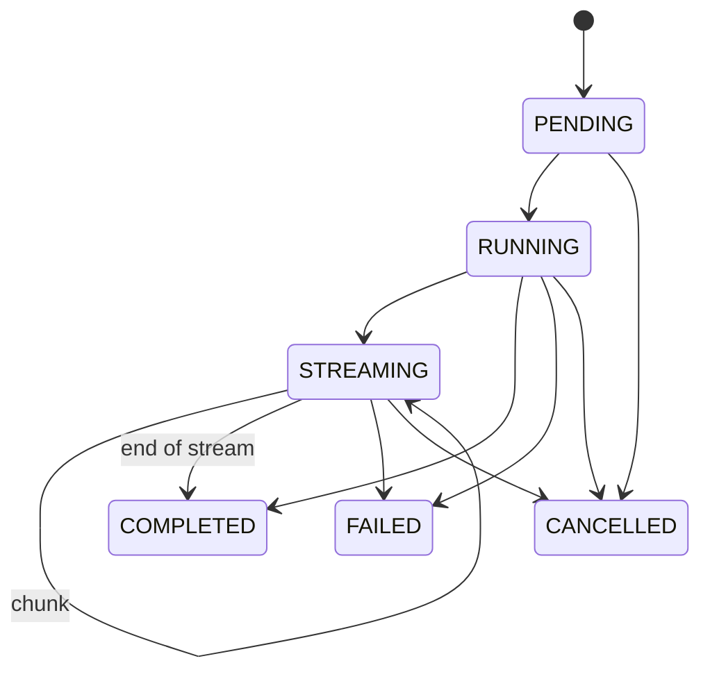
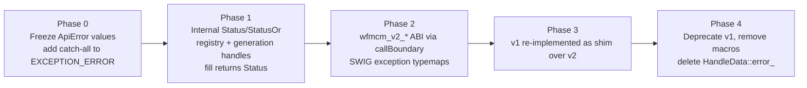

# Proposed Design: WFMCM API Error Handling (v2)

Status: Proposal · Scope: `api/api/*` (C ABI + SWIG consumers Java / C# / Python)

---

## TL;DR

Today, when a WFMCM call fails, the library stashes the error in a hidden slot, and the caller has to ask "what went wrong?" afterwards. That slot is shared across threads, is overwritten by the next call, and sometimes holds the wrong answer. This proposal replaces it with one simple rule:

**Every function returns its result or its error directly in the call.** If the caller wants the full details, it optionally asks for an error object in the same call.

This is the same shape used by gRPC, SQLite, and most modern C libraries.

## How to read this document

- §1 — what is wrong today, with evidence from the code.
- §2 — the new design.
- §3 — how to get there, phase by phase.
- §4 — how we will test it.
- §5 — the trade-offs and risks.
- §6 — why the effort is worth it.

## A quick word on the terms used

| Term | Meaning in this document |
|---|---|
| **Sentinel value** | A special return value (like `""` or `0`) that means "there is nothing to return". The problem: the same value is also used to mean "something went wrong", so the caller cannot tell the two apart. |
| **Ambient error state** | Error information kept in a hidden spot (a global or thread-local variable) instead of being returned. This is the old C `errno` pattern. |
| **Handle** | A small number that stands for a large object (a model, an instrument, a request) held inside the library. |
| **Race condition** | A bug that only shows up when two threads touch the same data at the same moment. |
| **ABI** | The binary contract between the library and its callers. Breaking it breaks already-compiled programs even when no source code changes. |
| **Canonical code** | A short, fixed list of error codes (think of HTTP status codes) that every caller agrees on. |

---

## 1. What's wrong today

### 1.1 Errors are kept in a hidden, shared slot instead of being returned

When a call fails, the library records the error in two hidden places instead of handing it back:

- A thread-local global slot: `globalError()` in [api/api/WfmcmApiInternal.cpp](api/api/WfmcmApiInternal.cpp#L258).
- A per-handle slot: `HandleError error_` on every `HandleData`, written by `setHandleError` in [api/api/WfmcmApiInternal.cpp](api/api/WfmcmApiInternal.cpp#L268). This writes both slots.

Consequences:

| Problem | Evidence |
|---|---|
| **Every successful call writes to its inputs.** `RETURN_SUCCESS` clears the handle's error slot, so a read-only call on a shared handle is actually a write. Two threads using the same model handle race on `error_`. | [api/api/WfmcmApiInternal.h](api/api/WfmcmApiInternal.h#L87) |
| **The per-handle error is last-writer-wins across threads.** The header says it "only resets when next API call is made using this handle." With concurrent callers, thread A can read thread B's error. | [api/api/WfmcmApi.h](api/api/WfmcmApi.h#L1398-L1405) |
| **Calc functions write status to the caller's input handle.** `calcBehavioralSpeedForInstrument` sets success/error on `requestContext`. | [api/api/WfmcmVasaraApi.cpp](api/api/WfmcmVasaraApi.cpp#L1195) |
| **The error slot also serves as fill status.** `HandleData::fill()` stores the `preFill()`/`postFill()` result in `error_`, and callers read it back as a status. Any later API call on the handle can overwrite it. | [api/api/WfmcmApiInternal.cpp](api/api/WfmcmApiInternal.cpp#L134-L162), [api/api/WfmcmVasaraApi.cpp](api/api/WfmcmVasaraApi.cpp#L86), [api/api/WfmcmVasaraApi.cpp](api/api/WfmcmVasaraApi.cpp#L1346) |
| **Reads return the wrong code.** `cancelRequest` returns `handleError().second.error_`. That is a thread-local slot that only `getHandleError` fills, so the code returned is stale or unrelated. | [api/api/WfmcmApi.cpp](api/api/WfmcmApi.cpp#L3586) |
| **The query has side effects and contradicts its docs.** `hasHandleError` returns `true` for an invalid handle, but the header says it returns false. `getHandleError` on an invalid handle overwrites the *global* error. | [api/api/WfmcmApi.cpp](api/api/WfmcmApi.cpp#L3623-L3639), [api/api/WfmcmApi.h](api/api/WfmcmApi.h#L1407-L1413) |

Keeping errors in a hidden slot (the old C `errno` pattern) is exactly what modern APIs avoid. It breaks under thread pools, background tasks, re-entrant calls, and the garbage-collector finalizers of the Java/C#/Python bindings. And no amount of locking fixes it, because the *protocol itself* — "call, then ask what happened" — is not atomic.

### 1.2 Special "sentinel" return values blur together success, "no data", and failure

Some functions signal failure by returning a special value instead of the real result — but the same value also means "there was nothing to return". (A "sentinel" is just such a special value, like `""` or `0`.)

| API | Sentinel (special value) | What it can mean |
|---|---|---|
| `getResult*` | `""` | failure **or** end of stream ([api/api/WfmcmApi.h](api/api/WfmcmApi.h#L1291)) |
| `getSwapRates` and similar | `""` | failure **or** optional component absent ([api/api/WfmcmVasaraApi.h](api/api/WfmcmVasaraApi.h)) |
| `hasResult` / `hasResultError` | `ApiResultStatus_UNKNOWN` | failure **or** genuinely unknown ([api/api/WfmcmApi.cpp](api/api/WfmcmApi.cpp#L3528)) |
| `resultIsError` | `0` | "not an error" **or** the call failed ([api/api/WfmcmVasaraApi.cpp](api/api/WfmcmVasaraApi.cpp#L1631)) |
| `resultGetCleanPrice` | `0.0` | a real price of 0 **or** failure. It also falls back to dirty price silently. ([api/api/WfmcmVasaraApi.cpp](api/api/WfmcmVasaraApi.cpp#L1666)) |

A financial API returning `0.0` for a price on failure is a correctness risk, not just an ergonomics problem.

### 1.3 Normal events (like "no more data") are reported as errors

`ApiErrorNoMoreData` marks end of stream ([api/api/WfmcmApi.cpp](api/api/WfmcmApi.cpp#L3409), [api/api/WfmcmApi.cpp](api/api/WfmcmApi.cpp#L3453)). As a result, every consumer loop treats an error as the normal exit. Alerting on "error rate" becomes meaningless, and SWIG exception mapping would throw on every stream end.

### 1.4 Error handling is copy-pasted macros, and exceptions can leak out

- `TRY` expands to a bare `try {` ([api/api/WfmcmApiInternal.h](api/api/WfmcmApiInternal.h#L137)). `EXCEPTION_ERROR` closes it and catches only `LibException` and `std::exception`, with **no `catch(...)`** ([api/api/WfmcmApiInternal.h](api/api/WfmcmApiInternal.h#L156)). Any other exception type propagates through `extern "C"`, which is undefined behavior and in practice calls `std::terminate` in the JVM/CLR host.
- `waitForResultWithTimeout` hand-splices a `catch (const std::future_error&)` into the macro pair. The result swallows the error and reports success ([api/api/WfmcmApi.cpp](api/api/WfmcmApi.cpp#L3490)).
- `RETURN_API_ERROR_WITH_TROUBLESHOOT` has a trailing `;` ([api/api/WfmcmApiInternal.h](api/api/WfmcmApiInternal.h#L135)). The `CHECK_*` macros use unbraced `if`s with `{FIXME}` notes.
- `calcValueForInstrument` has hand-rolled catch arms that differ from the macros. It also collapses result failures into generic `ApiErrorException`, losing the original code ([api/api/WfmcmVasaraApi.cpp](api/api/WfmcmVasaraApi.cpp#L1401-L1409)).
- `cloneHandle` has no `TRY` at all.
- `getResult*` and `getResultError*` duplicate their `if(!handles)` guards ([api/api/WfmcmApi.cpp](api/api/WfmcmApi.cpp#L3496-L3526)).

Every function reimplements the boundary. A boundary that is correct only by convention will be wrong somewhere, and it already is.

### 1.5 Error codes are unlabeled, unstable, and mix unrelated things

`ApiError` in [api/api/WfmcmApiEnumsDefs.h](api/api/WfmcmApiEnumsDefs.h) has several problems:

- Values are **implicit and sequential**, with no "DO NOT REORDER" guard. `HandleType` has one. Inserting a value silently renumbers every later code in Java, C#, and Python.
- Unrelated axes are mixed together: validation (`ApiErrorInvalidTimeout`), system (`ApiErrorSend`), lifecycle, flow control (`ApiErrorNoMoreData`), cancellation, business data (`ApiErrorNoRatesFiles`), and a catch-all (`ApiErrorException`).
- Nothing tells a caller whether a code is retryable, a caller bug, or a server bug.
- The code above `HandleError` itself says `//TODO: convert this to std::error_code` ([api/api/WfmcmApiInternal.h](api/api/WfmcmApiInternal.h#L332)).

### 1.6 Diagnostics are flattened into one big string

`getGlobalTroubleShootInfo` joins the nested `LibException` chain into a single `"; "`-separated string ([api/api/WfmcmApiInternal.cpp](api/api/WfmcmApiInternal.cpp#L302)). Structure (frame, component, key/value context) is lost. There's no request ID and no redaction. Results come back in thread-local JSON buffers that are valid only "until the next calc on this thread."

### 1.7 Handles can be faked or freed, and the checks race

- `handleData(h)` is a `reinterpret_cast` of the handle integer, with no registry lookup ([api/api/WfmcmApiInternal.cpp](api/api/WfmcmApiInternal.cpp#L238)).
- `isValidHandle` followed by a separate dereference is a TOCTOU race ([api/api/WfmcmApi.cpp](api/api/WfmcmApi.cpp#L3661)).
- A freed or forged handle gives a use-after-free, not `InvalidArgument`.
- `UPGRADE_TO_WRITE_LOCK_HANDLE` unlocks the read lock and then takes the write lock. That isn't atomic, so the state validated under the read lock may be gone ([api/api/WfmcmApiInternal.h](api/api/WfmcmApiInternal.h#L75), used at [api/api/WfmcmApi.cpp](api/api/WfmcmApi.cpp#L3429)).

No error model is sound if "is this handle valid?" can't be answered reliably.

### 1.8 Some behavior toggles are half-removed

`setErrorBehavior` is disabled (`#if 0` at [api/api/WfmcmApi.cpp](api/api/WfmcmApi.cpp#L361), stubs at [api/api/WfmcmApi.cpp](api/api/WfmcmApi.cpp#L3032-L3035)), but it is still documented ([api/api/WfmcmApi.h](api/api/WfmcmApi.h#L1180-L1198)). Consumers can't tell which contract applies.

---

## 2. The new design

### 2.1 The C contract: every call returns a result or an error

Every exported function follows one shape: it returns a **code** (a number) and can optionally fill in an **error object** with the details:

```c
WFMCM_NODISCARD WFMCM_API wfmcm_code WFMCM_CALLCONV
wfmcm_v2_<verb>(/* inputs */, /* T* out (nullable if unused) */, wfmcm_status** status /* nullable */);
```

Rules:

1. **The return value is the canonical code.** `WFMCM_OK == 0`. The code alone is always enough to branch on.
2. **`status` is optional rich detail.** If the caller passes a `status` and the call fails, `*status` receives a freshly allocated object the caller must release with `wfmcm_status_free`. On success, `*status` is set to `NULL`. There is no hidden error slot anywhere.
3. **Outputs are written only on `WFMCM_OK`.** On failure, `*out` is left unchanged, so there are no partial writes. The one documented exception is `*needed` in the buffer APIs (§2.5), which is written on `WFMCM_BUFFER_TOO_SMALL` so the caller can resize.
4. **Input handles are never modified** by read-only operations. Error reporting never writes to any handle.
5. **Every exported function is `noexcept`.** An exception can never leak out of the library (§2.4).
6. **Thread safety.** A `wfmcm_status*` is immutable once returned and can be read from any thread. It is independent of every handle.
7. **Code/status consistency.** If a call returns a non-`NULL` status, `wfmcm_status_code(status)` equals the returned code. If status materialization itself fails (allocation), `*status` stays `NULL` and the return code alone is authoritative.

Opaque status API:

```c
typedef struct wfmcm_status wfmcm_status;               /* opaque */

wfmcm_code   wfmcm_status_code(const wfmcm_status*);
int32_t      wfmcm_status_domain(const wfmcm_status*);    /* e.g. WFMCM_DOMAIN_RATES */
int32_t      wfmcm_status_domain_code(const wfmcm_status*);/* e.g. RATES_FILE_MISSING */
int          wfmcm_status_retryable(const wfmcm_status*);
const char*  wfmcm_status_message(const wfmcm_status*);   /* UTF-8, lifetime == status */
const char*  wfmcm_status_request_id(const wfmcm_status*);
size_t       wfmcm_status_detail_count(const wfmcm_status*);
const char*  wfmcm_status_detail_key(const wfmcm_status*, size_t i);
const char*  wfmcm_status_detail_value(const wfmcm_status*, size_t i);
size_t       wfmcm_status_frame_count(const wfmcm_status*);   /* troubleshoot trace */
const char*  wfmcm_status_frame_component(const wfmcm_status*, size_t i);
const char*  wfmcm_status_frame_message(const wfmcm_status*, size_t i);
const wfmcm_status* wfmcm_status_cause(const wfmcm_status*);  /* borrowed, may be NULL */
wfmcm_code   wfmcm_status_to_json(const wfmcm_status*, char* buf, size_t cap, size_t* needed);
void         wfmcm_status_free(wfmcm_status*);               /* NULL-safe */
```

Why an opaque object with accessors: the layout can evolve without breaking the ABI (as with SQLite, Vulkan, and gRPC core). SWIG wraps it trivially, and there are no `std::` types at the boundary.

### 2.2 Error codes: a small fixed list, plus detail codes

Two levels of codes. The **canonical** code is a short, fixed list the caller branches on (think of HTTP status codes). The **domain** code carries the specifics for humans and support.

```c
/* DO NOT REORDER. DO NOT REUSE. Values are part of the ABI. */
typedef enum wfmcm_code {
  WFMCM_OK                   = 0,
  WFMCM_CANCELLED            = 1,   /* caller cancelled */
  WFMCM_UNKNOWN              = 2,   /* untranslatable exception */
  WFMCM_INVALID_ARGUMENT     = 3,   /* caller bug: fix input, do not retry */
  WFMCM_DEADLINE_EXCEEDED    = 4,   /* timeout elapsed */
  WFMCM_NOT_FOUND            = 5,   /* handle/request/resource does not exist */
  WFMCM_ALREADY_EXISTS       = 6,
  WFMCM_PERMISSION_DENIED    = 7,
  WFMCM_RESOURCE_EXHAUSTED   = 8,   /* memory, queue full */
  WFMCM_FAILED_PRECONDITION  = 9,   /* wrong state: not filled, not setup */
  WFMCM_ABORTED              = 10,  /* concurrency conflict, retry whole op */
  WFMCM_OUT_OF_RANGE         = 11,
  WFMCM_UNIMPLEMENTED        = 12,
  WFMCM_INTERNAL             = 13,  /* library invariant broken: report bug */
  WFMCM_UNAVAILABLE          = 14,  /* transient: send/receive; retryable */
  WFMCM_DATA_LOSS            = 15,
  WFMCM_BUFFER_TOO_SMALL     = 100  /* ABI-specific; *needed is set */
} wfmcm_code;
```

- These values match gRPC/Abseil, so every SRE runbook, dashboard, and retry library already knows what they mean.
- **Domain codes** (`int32_t`, namespaced by `wfmcm_domain`) carry the specifics: `RATES/NO_RATES_FILES`, `RATES/INVALID_RATES_FILES`, `MODEL/CONFIG_HASH_MISMATCH`, `TRANSPORT/SEND`, and so on. They live in a single registry header with explicit values and a CI check that rejects renumbering. Domain detail is exposed as the `(domain, domain_code)` pair, never a merged integer; any combined encoding (e.g. `domain << 16 | domain_code`) is generated by the binding layer, not hand-assigned.
- **Legacy mapping** is a total, one-to-one table from every `ApiError` value to (canonical, domain, domain_code), maintained in a single header. The table must cover the entire enum — CI fails if a new `ApiError` is added without a row. For example: `ApiErrorInvalidTimeout → INVALID_ARGUMENT`, `ApiErrorTimeout → DEADLINE_EXCEEDED`, `ApiErrorOperationCancelled → CANCELLED`, `ApiErrorRequestNotFound → NOT_FOUND`, `ApiErrorSend/Receive → UNAVAILABLE`, `ApiErrorException → INTERNAL` or `UNKNOWN`, `ApiErrorNotCancellable → FAILED_PRECONDITION`, `ApiErrorOperationNotSupported → UNIMPLEMENTED`. `ApiErrorNoMoreData` is **removed** from the error space (§2.6).
- **`retryable`** is computed from the canonical code by default and can be overridden per status. Defaults follow gRPC: `UNAVAILABLE` is retryable, `RESOURCE_EXHAUSTED` when backpressure is configured, and `ABORTED` is **non-retryable** because it represents a conflict the application must reconcile.

### 2.3 Inside the library: a Status object

```cpp
namespace wfmcm {

class [[nodiscard]] Status {
public:
  static Status Ok() noexcept;
  Status(Code, Domain, int32_t domainCode, std::string message);
  bool ok() const noexcept;
  Code code() const noexcept;
  Status&& withDetail(std::string key, std::string value) &&;   // bounded, redacted
  Status&& withFrame(std::string component, std::string msg) &&;
  Status&& withRequestId(std::string id) &&;
  Status&& withCause(Status cause) &&;
  std::error_code toErrorCode() const noexcept;                 // wfmcm_category()
private:
  std::shared_ptr<const StatusRep> rep_;                        // null == OK; cheap copy
};

template <class T> using StatusOr = wfmcm::expected<T, Status>; // tl::expected shim until C++23

#define WFMCM_RETURN_IF_ERROR(expr)          /* one of only two permitted macros */
#define WFMCM_ASSIGN_OR_RETURN(lhs, expr)
}
```

- A successful `Status` allocates nothing — the happy path stays free.
- The builder methods (`withDetail`, `withFrame`, `withRequestId`, `withCause`) attach context to an error. They are safe under out-of-memory: they cap how much data is attached and fall back to a preallocated representation instead of throwing.
- `toErrorCode()` bridges to the standard `std::error_code` type, so existing code that already uses `std::error_code` keeps working. It maps only the canonical code; the domain and domain code cannot fit in `std::error_code`'s single number and are dropped, so code that needs that detail must keep the `Status`.
- Inside the library, functions return `Status` or `StatusOr<T>` (a value-or-error). Exceptions are still allowed internally (the pricing core throws `LibException`), but they are converted to `Status` in exactly one place.
- `fill()`, `preFill()`, and `postFill()` return `Status`; the old `error_` member on handles is deleted.

### 2.4 One safe wrapper around every function

A single wrapper, `callBoundary`, is the only place where exceptions become statuses. Every exported function is a thin one-liner that calls it:

```cpp
template <class F>
wfmcm_code callBoundary(wfmcm_status** out, std::string_view op, F&& body) noexcept {
  if (out) *out = nullptr;
  Status s;
  try {
    s = std::forward<F>(body)();
  } catch (...) {
    s = translateCurrentException();            // noexcept; internal OOM fallback built in
  }
  // The no-throw guarantee extends past the catch. withFrame/withRequestId/log/toC
  // are all noexcept-safe: they bound their work and substitute a preallocated
  // representation instead of throwing.
  if (!s.ok()) {
    s = std::move(s).withFrame("api", std::string(op)).withRequestId(currentRequestId());
    log(s);                                     // structured, redacted
    if (out) *out = toC(std::move(s));          // noexcept; leaves *out NULL if it cannot allocate
  }
  return toCode(s);
}

Status translateCurrentException() noexcept {
  try { throw; }
  catch (const LibException& e)       { return fromLibException(e); } // walks nested chain into frames
  catch (const std::bad_alloc&)       { return Status(RESOURCE_EXHAUSTED, ...); }
  catch (const std::future_error& e)  { return fromFutureError(e); }  // no longer swallowed
  catch (const std::invalid_argument& e) { return Status(INVALID_ARGUMENT, ...); }
  catch (const std::exception& e)     { return Status(INTERNAL, ...); }
  catch (...)                         { return Status(UNKNOWN, "non-standard exception"); }
}
```

No-throw spans the entire boundary, not just the `try`. `translateCurrentException`, every `Status` builder, `log`, and `toC` are `noexcept`-safe: each bounds the number and size of details and frames and, on allocation failure, substitutes a preallocated representation rather than throwing. `toC` is the single ownership handoff — if it cannot allocate the C object it leaves `*status` as `NULL` and the return code remains authoritative (§2.1).

Every exported function becomes a one-liner:

```cpp
extern "C" wfmcm_code wfmcm_v2_calc_value(wfmcm_handle model, wfmcm_handle instr,
                                          wfmcm_result** out, wfmcm_status** st) noexcept {
  return callBoundary(st, "calc_value", [&]() -> Status {
    WFMCM_ASSIGN_OR_RETURN(auto m, registry().acquire<Model>(model));
    WFMCM_ASSIGN_OR_RETURN(auto i, registry().acquire<Instrument>(instr));
    WFMCM_ASSIGN_OR_RETURN(auto r, pricing::value(*m, *i));
    *out = registry().publish(std::move(r));
    return Status::Ok();
  });
}
```

Enforcement:

- A clang-tidy rule (or grep in CI) fails the build if a function in `WfmcmApi*.cpp` is exported without calling `callBoundary`.
- The legacy macros `TRY`, `EXCEPTION_ERROR`, `RETURN_SUCCESS`, `RETURN_ERROR`, and `CHECK_*` are banned from new code.

### 2.5 Returning text: two patterns

Two patterns, chosen per API and documented:

1. **Caller buffer with size query** (for hot or small values):

   ```c
   wfmcm_code wfmcm_v2_result_to_json(wfmcm_result*, char* buf, size_t cap, size_t* needed, wfmcm_status**);
   ```

   - Call with `buf == NULL` to get `*needed`.
   - If `cap` is too small, the call returns `WFMCM_BUFFER_TOO_SMALL` with `*needed` set, and never truncates silently. Writing `*needed` here is the one documented exception to the "outputs only on `WFMCM_OK`" rule (§2.1).
2. **Owned string** (for large, one-shot values):

   ```c
   wfmcm_code wfmcm_v2_get_result(wfmcm_request*, wfmcm_string** out, wfmcm_status**);
   const char* wfmcm_string_data(const wfmcm_string*);
   size_t      wfmcm_string_size(const wfmcm_string*);
   void        wfmcm_string_free(wfmcm_string*);
   ```

   SWIG typemaps convert and free these automatically.

No thread-local result buffers. Lifetime is always explicit and never tied to "the next call on this thread."

### 2.6 "No data" and "no value" are not errors

Some outcomes are normal answers, not mistakes. Today they are reported as errors; in v2 they become ordinary results:

| Situation | Today | v2 |
|---|---|---|
| Stream exhausted | `""` + `ApiErrorNoMoreData` | `WFMCM_OK` + `*state = WFMCM_STREAM_END` (or `*has_value = 0`) |
| Optional component absent (swap rates, etc.) | `""` + check `getError` | `WFMCM_OK` + `*found = 0` |
| Clean price unavailable | `0.0`, silently uses dirty price | `WFMCM_OK` + `*has_value = 0`. Any fallback happens only through an explicit `wfmcm_v2_result_get_price(r, WFMCM_PRICE_CLEAN_OR_DIRTY, ...)`. |
| `hasResult` status unknown vs. failed | `ApiResultStatus_UNKNOWN` for both | Code for the failure; `*state` for the answer |
| `resultIsError` | `0` on failure | `WFMCM_OK` + `*is_error` |

Rule: **a non-OK code always means the call could not do what was asked.** An empty result is data, not an error.

### 2.7 Two kinds of failure: the call failed vs. the answer is "no"

A pricing call can *run successfully* and still produce a *business* "no" (for example, the instrument cannot be priced under this model). These are different things and must not share one error channel:

- **Call failure**: bad handle, invalid input, internal error, or timeout. Reported as a non-OK `wfmcm_code` plus `wfmcm_status`. No result object is produced.
- **Business outcome**: `WFMCM_OK` plus a result object whose `wfmcm_v2_result_outcome(r, &outcome, &detail_status)` reports `PRICED`, `PARTIAL`, or `NOT_PRICEABLE`, with its own `wfmcm_status*` for the diagnosis.

Business outcomes are not collapsed into generic `ApiErrorException` the way [api/api/WfmcmVasaraApi.cpp](api/api/WfmcmVasaraApi.cpp#L1401-L1409) does today, and the original domain code is preserved.

### 2.8 Long-running requests: explicit states

Each request moves through a clear set of states:



```c
wfmcm_code wfmcm_v2_request_wait(wfmcm_request*, int64_t timeout_ms,
                                 wfmcm_request_state* state, wfmcm_status**);
wfmcm_code wfmcm_v2_request_next(wfmcm_request*, int64_t timeout_ms,
                                 wfmcm_string** chunk, wfmcm_request_state* state, wfmcm_status**);
wfmcm_code wfmcm_v2_request_cancel(wfmcm_request*, wfmcm_status**);
wfmcm_code wfmcm_v2_request_failure(wfmcm_request*, wfmcm_status** why);   /* terminal FAILED only */
```

- **The wait timing out** returns `WFMCM_DEADLINE_EXCEEDED`, and the request stays alive. **The request having failed** returns `WFMCM_OK` from wait with `state == FAILED`; the reason comes from `wfmcm_v2_request_failure`. **The request having been cancelled** returns `WFMCM_OK` with `state == CANCELLED`. Waiting and the request's outcome are separate things.
- **Cancel is idempotent.** Cancelling a request that is already terminal returns `WFMCM_OK`; cancelling a request that doesn't exist returns `WFMCM_NOT_FOUND`. `ApiErrorNotCancellable` becomes `FAILED_PRECONDITION` only for operations that truly can't be cancelled.
- The state is an atomic enum on the request object. There is no read-then-write lock upgrade.

### 2.9 Safe handles

- Handles are `{index:32, generation:32}` into a registry of `shared_ptr<HandleData>`, and are never raw pointers.
- `registry().acquire<T>(h)` returns `StatusOr<std::shared_ptr<T>>` in a single atomic lookup: `NOT_FOUND` for stale or freed handles, `INVALID_ARGUMENT` for the wrong type.
  - This removes the TOCTOU in `isValidHandle` followed by a dereference.
  - The `shared_ptr` keeps the object alive for the whole call, even if another thread frees the handle.
- Locking uses per-object `std::shared_mutex` without an upgrade. An operation that may write takes the unique lock up front, or uses copy-on-write and publishes a new immutable snapshot. The latter is preferred for model and config objects.
- A double free or foreign handle is diagnosable (`NOT_FOUND` with domain `HANDLE/STALE_GENERATION`) instead of undefined behavior.

### 2.10 What Java, C#, and Python see

The binding layer turns non-OK codes into the idiomatic exception type for each language:

| Canonical | Java / C# | Python |
|---|---|---|
| `INVALID_ARGUMENT`, `OUT_OF_RANGE` | `WfmcmInvalidArgumentException` (extends `IllegalArgumentException` / `ArgumentException`) | `WfmcmInvalidArgument(ValueError)` |
| `NOT_FOUND` | `WfmcmNotFoundException` | `WfmcmNotFound(LookupError)` |
| `FAILED_PRECONDITION` | `WfmcmFailedPreconditionException` (`IllegalStateException` / `InvalidOperationException`) | `WfmcmFailedPrecondition(RuntimeError)` |
| `DEADLINE_EXCEEDED` | `WfmcmTimeoutException` (`TimeoutException`) | `WfmcmTimeout(TimeoutError)` |
| `CANCELLED` | `WfmcmCancelledException` (`CancellationException` / `OperationCanceledException`) | `WfmcmCancelled` |
| `UNAVAILABLE`, `ABORTED`, `RESOURCE_EXHAUSTED` | `WfmcmTransientException` (`isRetryable() == true`) | `WfmcmTransient` |
| `INTERNAL`, `UNKNOWN`, `DATA_LOSS` | `WfmcmInternalException` | `WfmcmInternal` |

- All of these derive from `WfmcmException`, which exposes `code`, `domain`, `domainCode`, `requestId`, `details`, `frames`, and `cause`. The binding performs a **full deep copy** of the status — code, domain, message, request ID, details, frames, and the nested cause chain — into managed objects, then frees the native `wfmcm_status*` immediately, so no native memory is owned by the GC.
- Non-error outcomes (§2.6) map to `Optional<T>`/`T?`/`None` and to iterators that end naturally. They never throw.

### 2.11 Versioning and compile-time safety

- New symbols use the `wfmcm_v2_` prefix. `wfmcm_abi_version()` returns `{major, minor}`, and bindings check it at load time.
- `WFMCM_NODISCARD` expands to `[[nodiscard]]` (C++17/C23) or `__attribute__((warn_unused_result))` / `_Check_return_`.
- Enum values are frozen. CI diffs the generated code tables against the last release and fails on any renumbering or removal.

### 2.12 Observability: request IDs and logging

- Each top-level call gets a **request ID** (caller-supplied through `wfmcm_v2_context_set_request_id`, or generated). It is stamped on every status and log line. Request ID is the one deliberate piece of ambient state in the design: it is a correlation token, scoped to the calling thread, and it is never used to report an outcome (§2.1 rule 2).
- An optional **log sink**, `wfmcm_set_log_callback(fn, user_data, min_level)`, receives structured events with code, domain, request ID, op, and duration. Without a sink, nothing is written to stderr.
- **Bounded, redacted details**: at most N details per status and M bytes per value. Instrument identifiers and paths are allowed; configuration secrets are never included.
- Structured frames replace the `"; "`-joined troubleshoot string, and `wfmcm_status_to_json` renders them for support tickets.

---

## 3. How we get there, phase by phase



- **Phase 0 (safety, no API change).**
  - Give every existing `ApiError` value an explicit number, matching today's implicit ordering, and add a "DO NOT REORDER" note.
  - Add `catch(...)` to `EXCEPTION_ERROR`.
  - Fix the `cancelRequest` stale-code read, the `hasHandleError` doc/code mismatch, and the swallowed `future_error`.
  - Remove the `setErrorBehavior` docs.
- **Phase 1 (internals).**
  - Introduce `Status`/`StatusOr` and `translateCurrentException`.
  - Convert `fill`/`preFill`/`postFill` to return `Status`.
  - Replace the `reinterpret_cast` in `handleData()` with a registry lookup, and remove `UPGRADE_TO_WRITE_LOCK_HANDLE`.
- **Phase 2 (new ABI).**
  - Add `wfmcm_v2_*` alongside v1, the opaque status, the buffer/string APIs, the request state machine, and the typed result outcomes.
  - Generate the SWIG exception hierarchy for Java, C#, and Python.
- **Phase 3 (shim).**
  - Each v1 function calls its v2 counterpart and then writes the legacy thread-local slot *only in the shim*, so legacy `getError`/`getHandleError` keep working unchanged.
  - Per-handle error writes are removed. `getHandleError` returns the last status the shim recorded for that handle on the *calling thread*, which is documented as deprecated.
  - Fidelity caveat: v1 conflates "absent optional" with "failure" through empty-string/`0.0` sentinels, and consumers tell them apart via `getError`. The shim reconstructs the legacy slot from v2 outcomes, but the absent-optional case v1 could never express cleanly will surface through the new semantics; consumers relying on the old sentinel-plus-`getError` dance must migrate off it before v1 is removed.
- **Phase 4.**
  - Mark v1 deprecated for one release cycle, then remove it.
  - Codemod the ~80 macro call sites to `callBoundary` + `WFMCM_RETURN_IF_ERROR`.

---

## 4. How we test it

| Test | Purpose |
|---|---|
| **Boundary fault injection** | For each exported function, inject `LibException`, `std::bad_alloc`, `std::future_error`, `int`, and a custom non-std type at every internal seam. Assert that the function returns a non-OK code, that the process never terminates, and that outputs are unchanged. |
| **Code-table golden test** | Snapshot every `wfmcm_code` and domain code value. Any renumbering fails CI. |
| **ABI conformance** | Header compiled as pure C11. `abi-compliance-checker` / `abidiff` against the previous release. |
| **No-ambient-state lint** | CI fails if v2 code references `globalError()`, `setHandleError`, or `HandleData::error_`. |
| **Concurrency (TSan)** | N threads doing read-only calls on the same model handle: zero data races. This proves successful calls no longer write to inputs. Includes concurrent free and use of the same handle, expecting `NOT_FOUND` rather than a crash. |
| **Async matrix** | Timeout vs. cancel vs. fail vs. complete, each racing the others. Cancel called twice. Wait after the terminal state. |
| **Fuzzing** | libFuzzer on handle values (forged and stale), buffer sizes (0, 1, needed-1), and JSON inputs. |
| **Binding tests** | Java, C#, and Python: each canonical code raises the mapped exception with request ID, details, and cause intact. End of stream and absent values never raise. |

---

## 5. Trade-offs and risks

| Decision | Alternative rejected | Why |
|---|---|---|
| Canonical gRPC-style codes | Custom categories | Widely understood, maps to retry policy, stable for more than 10 years in gRPC/Abseil. |
| Opaque status + accessors | Plain C struct with fixed `char[]` fields | Can evolve without an ABI break. No truncation. Supports nested causes and frames. |
| Status out-parameter + return code | Only a thread-local last-error | Thread-local state breaks under async, pools, and GC finalizers, and is the root cause of today's bugs. |
| Status out-parameter + return code | Returning a status handle only | The code alone must be enough for C callers who don't want to allocate. |
| Explicit non-error outcomes | `NoMoreData` as an error | Keeps error metrics meaningful and exceptions reserved for exceptional cases. |
| `tl::expected` shim | Wait for C++23 | Unblocks now. Becomes a type alias when the toolchain upgrades. |

Risks:

- **Double API surface during migration.** Mitigated by v1 being a thin shim with no independent logic.
- **Binding churn for consumers.** Mitigated by the exception base classes deriving from the standard types, so existing `catch (RuntimeException)` still works.
- **Allocation on failure.** An OK status never allocates. On the failure path, status materialization is `noexcept`-safe: if allocation fails, `*status` stays `NULL` and the returned code remains authoritative (§2.1, §2.4).
- **Lossy v1 semantics in the shim.** v1 uses empty-string/`0.0` sentinels for both "absent" and "failure". The shim reproduces the error slot but cannot express the absent-optional case the way v1 consumers expect; these consumers must migrate before v1 is removed (§3, Phase 3).

---

## 6. Why this is worth it

- **Correctness**: no stale or cross-thread error reads, no `0.0` price on failure, no exceptions crossing `extern "C"`, no use-after-free on stale handles.
- **Concurrency**: read-only calls are actually read-only, so shared model handles scale across threads without error-slot races.
- **Operability**: canonical codes plus request IDs plus structured frames give dashboards, retry policies, and support triage a common vocabulary.
- **Evolvability**: frozen codes, an opaque status, and versioned symbols let diagnostics grow without breaking any binding.
- **Maintainability**: about 80 hand-rolled boundaries become one audited `callBoundary`, and the macro DSL is removed.
- **Consumer experience**: idiomatic exceptions and optionals in Java, C#, and Python, generated from one table instead of a manual `getError` follow-up after every call.
